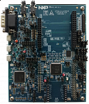

:pdf-download: ../../../_assets/boards/lpcxpresso55s36/mcuxsdk-lpcxpresso55s36.pdf
.. _lpcxpresso55s36:

LPCXpresso55S36
####################

Overview
********

The LPCXpresso55S36 development board provides the ideal platform for evaluation of and development with the LPC553x/S3x MCU based on the Arm Cortex-M33 architecture. The board includes a high-performance onboard debug probe and accelerometer, with several options for adding off-the-shelf add-on boards for networking, sensors, displays, and other interfaces.

The LPCXpresso55S36 is fully supported by the MCUXpresso suite of tools, which provides device drivers, middleware and examples to allow rapid development, plus configuration tools and an optional free IDE. MCUXpresso software is compatible with the open source MCU operating system FreeRTOS, tools from popular tool vendors such as Arm and IAR, and the LPCXpresso55S36 may also be used with the popular debug probes available from SEGGER and P&E Micro.

MCU device and part on board is shown below:

 - Device: LPC55S36
 - PartNumber: LPC55S36JBD100

Getting Started with MCUXpresso SDK Package
*******************************************
.. toctree::
   :maxdepth: 1

   gettingStarted/gsindex.md

Getting Started with MCUXpresso SDK GitHub
*******************************************
.. toctree::
   :maxdepth: 1

   ../../../gsd/repo.rst
Release Notes
*******************************************
.. toctree::
   :maxdepth: 1

   releaseNotes/rnindex.md

ChangeLog
*******************************************
.. toctree::
   :maxdepth: 1

   changeLog/clindex.md

Driver API Reference Manual
****************************

This section provides a link to the Driver API RM, detailing available drivers and their usage to help you integrate hardware efficiently.

:ref:`LPC55S36_drivers`

Middleware Documentation
*****************************

Find links to detailed middleware documentation for key components. While not all onboard middleware is covered, this serves as a useful reference for configuration and development.

Multicore
=========

:ref:`multicore`

Audio Voice components
======================

:ref:`components`

Maestro Audio Framework for MCU
===============================

:ref:`maestro`

FreeMASTER
==========

:doc:`freemaster <../../../middleware/freemaster/doc/index>`

FreeRTOS
========

:ref:`freertos`

File systemFatfs
================

:ref:`fatfs`
