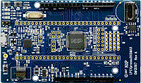

.. _lpcxpresso860max:

LPCXpresso860MAX
####################

Overview
********

The LPC86x are an Arm Cortex-M0+ based, low-cost 32-bit MCU family operating at CPU frequencies of up to 48 MHz. The LPC86x support up to 64 KB of flash memory and 8 KB of SRAM.

The peripheral complement of the LPC86x includes a CRC engine, one I2C-bus interface, one I3C-MIPI bus interface, up to three USARTs, up to two SPI interfaces, one multi-rate timer, self-wake-up timer, two FlexTimers, a DMA, one 12-bit ADC, one analog comparator, function-configurable I/O ports through a switch matrix, an input pattern match engine, and up to 54 general-purpose I/O pins.

MCU device and part on board is shown below:

 - Device: LPC865
 - PartNumber: LPC865M201JBD64

Getting Started
****************
.. toctree::
   :maxdepth: 1
   :caption: Getting Started with MCUXpresso SDK for LPCXpresso860MAX

   ../../commongs/gettingStarted/gsindex.md

