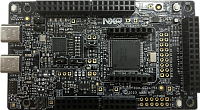

:pdf-download: ../../../_assets/boards/frdmmcxa156/mcuxsdk-frdmmcxa156.pdf
.. _frdmmcxa156:

FRDM-MCXA156
####################

Overview
********

| The NXP FRDM-MCXA156 is a development board for the A15X/A14X 96 MHz Arm Cortex-M33 microcontroller.

MCU device and part on board is shown below:

 - Device: MCXA156
 - PartNumber: MCXA156VLL

Getting Started with MCUXpresso SDK Package
*******************************************
.. toctree::
   :maxdepth: 1

   ../../../gsd/package.rst

Getting Started with MCUXpresso SDK GitHub
*******************************************
.. toctree::
   :maxdepth: 1

   ../../../gsd/repo.rst

Release Notes
*******************************************
.. toctree::
   :maxdepth: 1

   releaseNotes/rnindex.md

ChangeLog
*******************************************
.. toctree::
   :maxdepth: 1

   changeLog/clindex.md

Driver API Reference Manual
****************************

This section provides a link to the Driver API RM, detailing available drivers and their usage to help you integrate hardware efficiently.

:ref:`MCXA156_drivers`

Middleware Documentation
*****************************

Find links to detailed middleware documentation for key components. While not all onboard middleware is covered, this serves as a useful reference for configuration and development.

MCU Boot
========

.. toctree::
   :maxdepth: 1

   ../../../middleware/mcuboot_opensource/README.md

FreeMASTER
==========

.. toctree::
   :maxdepth: 1

   ../../../middleware/freemaster/doc/index.md

FreeRTOS
========

:ref:`freertos`

File systemFatfs
================

:ref:`fatfs`
