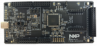

:pdf-download: ../../../_assets/boards/frdmmcxa344/mcuxsdk-frdmmcxa344.pdf
.. _frdmmcxa344:

FRDM-MCXA344
####################

Overview
********

FRDM-MCXA344 are compact and scalable development boards for rapid prototyping of
MCX A27X MCUs. They offer industry standard headers for easy access to the MCUs I/Os,
integrated open-standard serial interfaces and an on-board MCU-Link debugger.
MCX A Series are high-performance, low-power microcontrollers with MAU,SmartDMA and performance efficiency.

The board is compatible with Arduino boards (Arduino UNO R3 and Arduino A4/A5), motor control boards
(FRDM-MC-LVBLDC and FRDM-MC-LVPMSM), Mikroe click boards, and Pmod boards. It can be used with a
wide range of development tools, including NXP MCUXpresso IDE, IAR Embedded Workbench, and Arm Keil
MDK. The board is lead-free and RoHS-compliant.

For debugging the MCXA346 MCU, the FRDM-MCXA344 board uses an onboard (OB) debug probe, MCU-Link lite
OB, which is based on another NXP MCU: LPC55S16

MCU device and part on board is shown below:

 - Device: MCXA344
 - PartNumber: MCXA344VLQ

Getting Started with MCUXpresso SDK Package
*******************************************
.. toctree::
   :maxdepth: 1

   ../../../gsd/package.rst

Getting Started with MCUXpresso SDK GitHub
*******************************************
.. toctree::
   :maxdepth: 1

   ../../../gsd/repo.rst
Release Notes
*******************************************
.. toctree::
   :maxdepth: 1

   releaseNotes/rnindex.md

ChangeLog
*******************************************
.. toctree::
   :maxdepth: 1

   changeLog/clindex.md

Driver API Reference Manual
****************************

This section provides a link to the Driver API RM, detailing available drivers and their usage to help you integrate hardware efficiently.

:ref:`MCXA344_drivers`

Middleware Documentation
*****************************

Find links to detailed middleware documentation for key components. While not all onboard middleware is covered, this serves as a useful reference for configuration and development.

MCU Boot
========

:doc:`mcuboot_opensource<../../../middleware/mcuboot_opensource/README.md>`

FreeMASTER
==========

:doc:`freemaster <../../../middleware/freemaster/doc/index>`

FreeRTOS
========

:ref:`freertos`

File systemFatfs
================

:ref:`fatfs`
