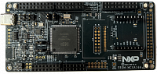

:pdf-download: ../../../_assets/boards/frdmmcxa346/mcuxsdk-frdmmcxa346.pdf
.. _frdmmcxa346:

FRDM-MCXA346
####################

Overview
********

The FRDM-MCXA346 board is a design and evaluation platform based on the NXP MCXA346 microcontroller
(MCU). The MCXA346 MCU is a low-power microcontroller for industrial and consumer Internet of Things
(IoT) applications. It has one Arm Cortex-M33 core running at speeds of up to 180 MHz. It supports industrial
communication protocol, brushless direct current (BLDC) motor / permanent magnet synchronous motor
(PMSM) control, and integrated sensor interfaces (I2C, and SPI).

The board is compatible with Arduino boards (Arduino UNO R3 and Arduino A4/A5), motor control boards
(FRDM-MC-LVBLDC and FRDM-MC-LVPMSM), Mikroe click boards, and Pmod boards. It can be used with a
wide range of development tools, including NXP MCUXpresso IDE, IAR Embedded Workbench, and Arm Keil
MDK. The board is lead-free and RoHS-compliant.

For debugging the MCXA346 MCU, the FRDM-MCXA346 board uses an onboard (OB) debug probe, MCU-Link lite
OB, which is based on another NXP MCU: LPC55S16

MCU device and part on board is shown below:

 - Device: MCXA346
 - PartNumber: MCXA346VLQ

Getting Started with MCUXpresso SDK Package
*******************************************
.. toctree::
   :maxdepth: 1

   ../../../gsd/package.rst

Getting Started with MCUXpresso SDK GitHub
*******************************************
.. toctree::
   :maxdepth: 1

   ../../../gsd/repo.rst
Release Notes
*******************************************
.. toctree::
   :maxdepth: 1

   releaseNotes/rnindex.md

ChangeLog
*******************************************
.. toctree::
   :maxdepth: 1

   changeLog/clindex.md

Driver API Reference Manual
****************************

This section provides a link to the Driver API RM, detailing available drivers and their usage to help you integrate hardware efficiently.

:ref:`MCXA346_drivers`

Middleware Documentation
*****************************

Find links to detailed middleware documentation for key components. While not all onboard middleware is covered, this serves as a useful reference for configuration and development.

MCU Boot
========

.. toctree::
   :maxdepth: 1

   ../../../middleware/mcuboot_opensource/README.md

FreeMASTER
==========

.. toctree::
   :maxdepth: 1

   ../../../middleware/freemaster/doc/index.md

FreeRTOS
========

:ref:`freertos`

File systemFatfs
================

:ref:`fatfs`
