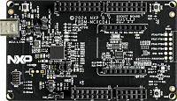

.. _frdmmcxc041:

FRDM-MCXC041
####################

Overview
********

The FRDM-MCXC041 is supported by a range of NXP and third-party development software.

MCU device and part on board is shown below:

 - Device: MCXC041
 - PartNumber: MCXC041VFK

Getting Started with MCUXpresso SDK Package
*******************************************
.. toctree::
   :maxdepth: 1

   ../../../gsd/package.rst

Getting Started with MCUXpresso SDK GitHub
*******************************************
.. toctree::
   :maxdepth: 1

   ../../../gsd/repo.rst

Release Notes
*******************************************
.. toctree::
   :maxdepth: 1

   releaseNotes/rnindex.md

ChangeLog
*******************************************
.. toctree::
   :maxdepth: 1

   changeLog/clindex.md
