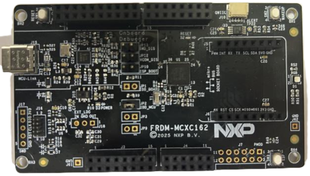

:pdf-download: ../../../_assets/boards/frdmmcxc353/mcuxsdk-frdmmcxc353.pdf

.. _frdmmcxc353:

FRDM-MCXC353
####################

Overview
********

FRDM-MCXC353 is a compact and scalable development board for rapid prototyping of the
MCXC353 (MCXC1SU family) MCU. It offers industry standard headers for easy access to the
MCU's I/Os, integrated open-standard serial interfaces, and an on-board MCU-Link debugger.
The MCX C series are cost-effective, low-power microcontrollers based on the Arm Cortex-M0+ core.

The board is compatible with Arduino boards, Mikroe click boards, and Pmod boards. It can be
used with a wide range of development tools, including NXP MCUXpresso IDE, IAR Embedded Workbench,
and Arm Keil MDK. The board is lead-free and RoHS-compliant.

For debugging the MCXC353 MCU, the FRDM-MCXC353 board uses an on-board (OB) MCU-Link debug probe.

MCU device and part on board is shown below:

 - Device: MCXC353
 - PartNumber: MCXC353MLF

SDK Introduction
*******************

.. only:: html

   For an introduction to the MCUXpresso SDK, see :doc:`MCUXpresso Software Development Kit (SDK) </introduction/README>`.

.. only:: latex

   .. toctree::
      :maxdepth: 1

      /introduction/README

Getting Started with MCUXpresso SDK Package
*******************************************
.. toctree::
   :maxdepth: 1

   ../../../gsd/package.rst

Getting Started with MCUXpresso SDK GitHub
*******************************************
.. toctree::
   :maxdepth: 1

   ../../../gsd/repo.rst

Release Notes
*******************************************
.. toctree::
   :maxdepth: 1

   releaseNotes/rnindex.md

ChangeLog
*******************************************
.. toctree::
   :maxdepth: 1

   changeLog/clindex.md

Driver API Reference Manual
****************************

This section provides a link to the Driver API RM, detailing available drivers and their usage to help you integrate hardware efficiently.

:ref:`MCXC353_drivers`

Middleware Documentation
*****************************

Find links to detailed middleware documentation for key components. While not all onboard middleware is covered, this serves as a useful reference for configuration and development.

FreeRTOS
========

:ref:`freertos`
