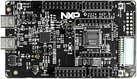

:pdf-download: ../../../_assets/boards/frdmmcxc444/mcuxsdk-frdmmcxc444.pdf
.. _frdmmcxc444:

FRDM-MCXC444
####################

Overview
********

| The FRDM-MCXC444 is supported by a range of NXP and third-party development software.

MCU device and part on board is shown below:

 - Device: MCXC444
 - PartNumber: MCXC444VLH

Getting Started with MCUXpresso SDK Package
*******************************************
.. toctree::
   :maxdepth: 1

   ../../../gsd/package.rst

Getting Started with MCUXpresso SDK GitHub
*******************************************
.. toctree::
   :maxdepth: 1

   ../../../gsd/repo.rst

Release Notes
*******************************************
.. toctree::
   :maxdepth: 1

   releaseNotes/rnindex.md

ChangeLog
*******************************************
.. toctree::
   :maxdepth: 1

   changeLog/clindex.md

Driver API Reference Manual
****************************

This section provides a link to the Driver API RM, detailing available drivers and their usage to help you integrate hardware efficiently.

:ref:`MCXC444_drivers`

Middleware Documentation
*****************************

Find links to detailed middleware documentation for key components. While not all onboard middleware is covered, this serves as a useful reference for configuration and development.

Multicore
=========

:ref:`multicore`

FreeMASTER
==========

:doc:`freemaster <../../../middleware/freemaster/doc/index>`

FreeRTOS
========

:ref:`freertos`
