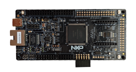

.. _frdmmcxe247:

FRDM-MCXE247
####################

Overview
********

The FRDM-MCXE247 board is a design and evaluation platform based on the NXP MCXE247
microcontroller (MCU). NXP MCXE247 MCU based on an Arm Cortex- M4F core, running
at speeds of up to 112 MHz with a 2.70–5.5 V supply.
The FRDM-MCXE247 board consists of one MCXE247 device with a 64 Mbit external serial
flash (provided by Winbond). The board also features FXLS8974CFR3 I2C accelerometer
sensor, one NMH1000 I2C Magnetic switch, three TJA1057GTK/3Z CAN PHY, Ethernet PHY,
RGB LED, push buttons, and MCU-Link debug probe circuit.
The board is compatible with the Arduino shield modules, Pmod boards, and mikroBUS.
For debugging the MCXE247 MCU, the FRDM-MCXE247 board uses an onboard (OB) debug
probe, MCU-Link OB, which is based on another NXP MCU: LPC55S16. 

MCU device and part on board is shown below:

 - Device: MCXE247
 - PartNumber: MCXE247VLQ

Getting Started
****************
.. toctree::
   :maxdepth: 1
   :caption: Getting Started with MCUXpresso SDK for FRDM-MCXE247

   ../../../gsd/package.rst

Release Notes
****************

**This is an Early Access Release (EAR) for FRDM-MCXE247 developement board. It shall be used for pre-production development only.**

Only drivers which has its example(s) in mcuxsdk/examples/_boards/frdmmcxe247/driver_examples folder were tested.

Supported Development Tools
===========================
 - MCUXpresso for VS Code v25.03
 - GCC Arm Embedded Toolchain

.. toctree::
   :maxdepth: 1
   :caption: MCUXpresso SDK Release Notes for FRDM-MCXE247

   releaseNotes/rnindex.md
