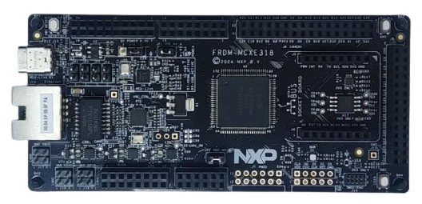

:pdf-download: ../../../_assets/boards/frdmmcxe31b/mcuxsdk-frdmmcxe31b.pdf
.. _frdmmcxe31b:

FRDM-MCXE31B
####################

Overview
********

The FRDM-MCXE31B board is a design and evaluation platform based on the NXP MCXE31B
microcontroller (MCU). NXP MCXE31B MCU based on an Arm Cortex- M7 core, running
at speeds of up to 160 MHz with a 2.70–5.5 V supply.
The FRDM-MCXE31B board consists of one MCXE31B device with a 64 Mbit external serial
flash (provided by Winbond). The board also features FXLS8974CFR3 I2C accelerometer
sensor, one NMH1000 I2C Magnetic switch, three TJA1057GTK/3Z CAN PHY, Ethernet PHY,
RGB LED, push buttons, and MCU-Link debug probe circuit.
The board is compatible with the Arduino shield modules, Pmod boards, and mikroBUS.
For debugging the MCXE31B MCU, the FRDM-MCXE31B board uses an onboard (OB) debug
probe, MCU-Link OB, which is based on another NXP MCU: LPC55S16. 

MCU device and part on board is shown below:

 - Device: MCXE31B
 - PartNumber: MCXE31BMPB

Getting Started with MCUXpresso SDK Package
*******************************************
.. toctree::
   :maxdepth: 1

   gettingStarted/gsindex.md

Getting Started with MCUXpresso SDK GitHub
*******************************************
.. toctree::
   :maxdepth: 1

   ../../../gsd/repo.rst

Release Notes
*******************************************
.. toctree::
   :maxdepth: 1

   releaseNotes/rnindex.md

ChangeLog
*******************************************
.. toctree::
   :maxdepth: 1

   changeLog/clindex.md

Driver API Reference Manual
****************************

This section provides a link to the Driver API RM, detailing available drivers and their usage to help you integrate hardware efficiently.

:ref:`MCXE31B_drivers`

Middleware Documentation
*****************************

Find links to detailed middleware documentation for key components. While not all onboard middleware is covered, this serves as a useful reference for configuration and development.

FreeRTOS
========

:ref:`freertos`
