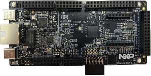

.. _frdmmcxn947:

FRDM-MCXN947
####################

Overview
********

| The NXP FRDM-MCXN947 is a development board for the N94x 150 MHz Arm Cortex-M33 TrustZone microcontroller, which is for Industrial and Consumer IoT Applications.

MCU device and part on board is shown below:

 - Device: MCXN947
 - PartNumber: MCXN947VDF

Getting Started
****************
.. toctree::
   :maxdepth: 1
   :caption: Getting Started with MCUXpresso SDK for FRDM-MCXN947

   ../mcxn9xxevk/gettingStarted/gsindex.md

Release Notes
****************
.. toctree::
   :maxdepth: 1
   :caption: MCUXpresso SDK Release Notes for FRDM-MCXN947

   releaseNotes/rnindex.md
