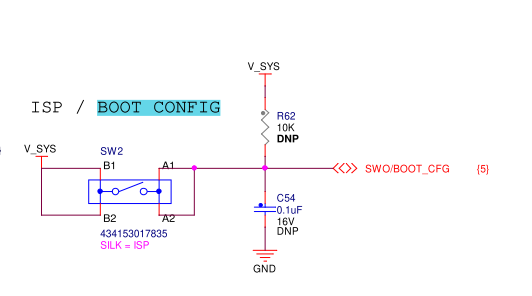
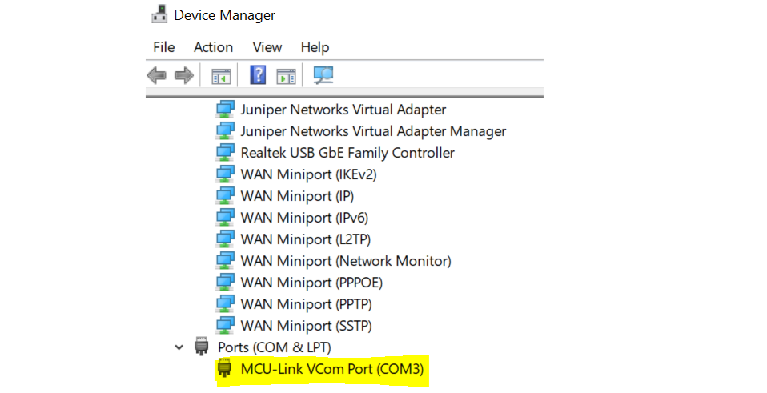
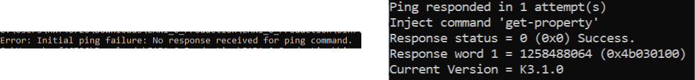

# Updating NBU for Wireless Examples

The Narrow Band Unit \(NBU\) firmware is included in the SDK folder as a signed and encrypted FW.

*middleware\\wireless\\ble\_controller\\bin\\mcxw70\_nbu\_ble\_hosted.sb4*

To program the NBU software for the MCXW70, perform the following steps:

1.  While holding pressed the **SW2** on the FRDM-MCXW70 board, attach the USB connector J28 to your computer. Then, release the **SW2** after you plugged the USB cable on your computer.

    

2.  Verify which COM port is assigned to your FRDM-MCXW70 board. To check the assigned COM port, in the Windows **Device Manager** program, search for Ports **\(COM & LPT\)** and save the COM port number. In this example, the assigned COM port is **COM3**.

    

3. Execute the following commands in order, replacing **COM3** with your actual COM port number (e.g., **COM3**):

    Make sure the device has entered ISP mode properly. If the device did not enter in ISP mode, it cannot be programmed.
    ```
    blhost.exe -p COM3 get-property 1
    ```

    The following examples show when the device did not enter ISP mode \(left\) and when it entered ISP mode correctly \(right\).


    

4. Erase the NBU flash region and program the NBU binary:

    ---

    **When the chip is blank (no valid NBU image at flash offset 0x0):**


    ```
    blhost.exe -p COM3 write-memory 0x80000 mcxw70_nbu_ble_hosted_test.sb4
    ```

    ---

    **When the chip is not blank (a valid NBU image already exists at flash offset 0x0):**

    **Step 1 — Write the new NBU binary to `NBU_UPDATE_IMG_ADDR`:**

    In this case, you need to program the nbu image to `NBU_UPDATE_IMG_ADDR` first.

    ```
    blhost.exe -p COM3 flash-erase-region <NBU_UPDATE_IMG_ADDR> 0x58000
    blhost.exe -p COM3 write-memory <NBU_UPDATE_IMG_ADDR> mcxw70_nbu_ble_hosted_test.sb4
    ```

    `NBU_UPDATE_IMG_ADDR` is read from the CMPA region of the IFR at offset `0x01000334`. The calculation follows the same rule as the recovery address:

    ```
    NBU_UPDATE_IMG_ADDR = IFR[0x01000334][31:11] × 4096
    ```

    To get the value, execute the following command:

    ```
    blhost.exe -p COM3 read-memory 0x01000334 4
    ```

    `NBU_UPDATE_IMG_ADDR` is located in the CMPA and can be updated. For detailed instructions on updating this field, please contact NXP technical support.

    **Step 2 — Invoke the ROM API runBootloader from application code on main core:**

    Then invoke the ROM API `runBootloader` function, passing a pointer to a variable set to `0xEB200200`. This instructs the ROM to copy the NBU image from `NBU_UPDATE_IMG_ADDR` to flash offset 0x0 and then trigger a reset.

    ```c
    /* BOOTLOADER_API_TREE_POINTER is defined in the SDK ROMAPI Driver header. */
    #define BOOTLOADER_API_TREE_POINTER ((bootloader_tree_t *)0x14847000u)

    int value = 0xEB200200;
    BOOTLOADER_API_TREE_POINTER->runBootloader(&value);
    /* The ROM will now copy the image at NBU_UPDATE_IMG_ADDR to flash 0x0 and reset. */
    ```

    > Refer to the `bootloader_tree_t` definition in the SDK ROMAPI Driver for the full structure layout.


    ---

    The two address fields and their IFR locations are summarised below:

    | Parameter | IFR / CMPA offset | Bit field | Formula |
    |---|---|---|---|
    | `NBU_RECOVERY_IMG_ADDR` | `0x01000330` | [31:11] | field × 4 KB |
    | `NBU_UPDATE_IMG_ADDR` | `0x01000334` | [31:11] | field × 4 KB |
