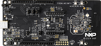

.. _frdmmcxw71:

FRDM-MCXW71
####################

Overview
********

The NXP FRDM-MCXW71 is a development board for the MCXW71 96 MHz Arm Cortex-M33 microcontroller.

MCU device and part on board is shown below:

 - Device: MCXW716C
 - PartNumber: MCXW716CMFTA

Getting Started with MCUXpresso SDK Package
*******************************************
.. toctree::
   :maxdepth: 1

   gettingStarted/gsindex.md

Getting Started with MCUXpresso SDK GitHub
*******************************************
.. toctree::
   :maxdepth: 1

   ../../../gsd/repo.rst

Release Notes
*******************************************
.. toctree::
   :maxdepth: 1

   releaseNotes/rnindex.md
