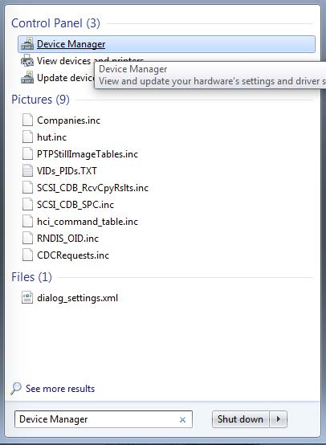

# How to determine COM Port

This section describes the steps necessary to determine the debug COM port number of your NXP hardware development platform. All NXP boards ship with a factory programmed, on-board debug interface MCU-LINK.

1.  To determine the COM port, open the Windows operating system **Device Manager**. This can be achieved by going to the Windows operating system **Start** menu and typing **Device Manager** in the search bar, as shown in [Figure 1](how_to_determine_com_port.md#FIG_DEVICEMANAGER).

    

2.  In the **Device Manager**, expand the **Ports \(COM & LPT\)** section to view the available ports.

