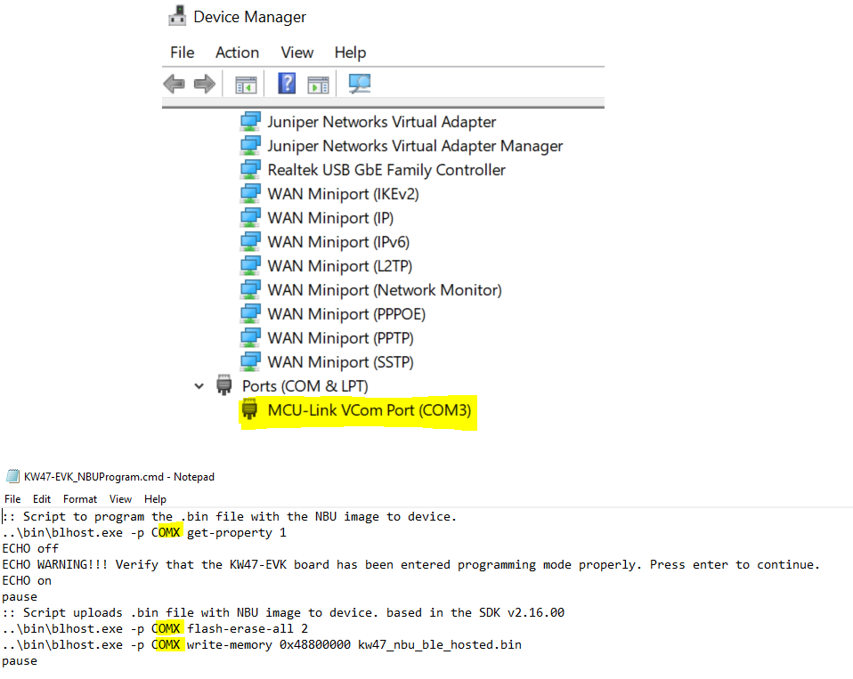
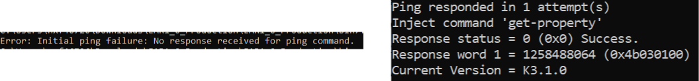

# Updating NBU for Wireless Examples

The Narrow Band Unit \(NBU\) firmware is included in the SDK folder as a signed and encrypted FW.

*middleware\\wireless\\ble\_controller\\bin\\mcxw72\_nbu\_ble\_hosted.bin*

To program the NBU software for the MCX-W72, perform the following steps:

1.  While holding pressed the **SW3** on the board, attach the USB connector J10 to your computer. Then, release the **SW3** after you plugged the USB cable on your computer.

2.  Verify which COM port is assigned to your board. To check the assigned COM port, in the Windows **Device Manager** program, search for Ports **\(COM & LPT\)** and save the COM port number. In this example, the assigned COM port is **COM3**.

    

3.  Open the [*04. Tools*](https://nxp1.sharepoint.com/:f:/r/teams/ext131/kw47/Documents/04.%20Tools?csf=1&web=1&e=NNX84h) folder that comes together with this document and go to the *script* folder. Locate the *KW47-EVK\_NBUProgram.cmd* and open it using any text editor. Replace all the references to **COMX** with the COM Port assigned to your MCX-W72-EVK board. Save the changes applied to the script.

    **Note:** To run the script, place the *blhost.exe* and the *KW47-EVK\_NBUProgram.cmd* script in the same folder. Both scripts can be found in the [*04. Tools*](https://nxp1.sharepoint.com/:f:/r/teams/ext131/kw47/Documents/04.%20Tools?csf=1&web=1&e=NNX84h) folder。

4.  Double click on the *KW47-EVK\_NBUProgram.cmd* script to program the NBU and load the FAT software. This script first executes a command to make sure the **MCXW72** has entered ISP mode properly. If the device did not enter in ISP mode, it cannot be programmed. The following examples show when the device did not enter in ISP \(left\) and when the device was programmed properly \(right\).

    

