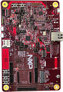

.. _mcxn5xxevk:

MCX-N5XX-EVK
####################

Overview
********

| The NXP N5xx-EVK is a development board for the N5xx 150 MHz Arm Dual Cortex-M33 TrustZone microcontroller, which is for Industrial and Consumer IoT Applications.

MCU device and part on board is shown below:

 - Device: MCXN547
 - PartNumber: MCXN547VDF

Getting Started with MCUXpresso SDK Package
*******************************************
.. toctree::
   :maxdepth: 1

   ../mcxn9xxevk/gettingStarted/gsindex.md

Getting Started with MCUXpresso SDK GitHub
*******************************************
.. toctree::
   :maxdepth: 1

   ../../../gsd/repo.rst
Release Notes
*******************************************
.. toctree::
   :maxdepth: 1

   releaseNotes/rnindex.md

ChangeLog
*******************************************
.. toctree::
   :maxdepth: 1

   changeLog/clindex.md

Driver API Reference Manual
****************************

This section provides a link to the Driver API RM, detailing available drivers and their usage to help you integrate hardware efficiently.

:ref:`MCXN547_drivers`

Middleware Documentation
*****************************

Find links to detailed middleware documentation for key components. While not all onboard middleware is covered, this serves as a useful reference for configuration and development.

Multicore
=========

:ref:`multicore`

MCU Boot
========

.. toctree::
   :maxdepth: 1

   ../../../middleware/mcuboot_opensource/README.md

Audio Voice components
======================

:ref:`components`

Maestro Audio Framework for MCU
===============================

:ref:`maestro`

eIQ
===

:ref:`eiq`

FreeMASTER
==========

.. toctree::
   :maxdepth: 1

   ../../../middleware/freemaster/doc/index.md

AWS IoT
=======

:ref:`aws_iot`

NXP Wi-Fi
=========

:ref:`wifi-bluetooth-802.15.4`

FreeRTOS
========

:ref:`freertos`

Wireless EdgeFast Bluetooth PAL
===============================

:ref:`edgefast_bluetooth`

lwIP
====

:ref:`lwip`

File systemFatfs
================

:ref:`fatfs`
