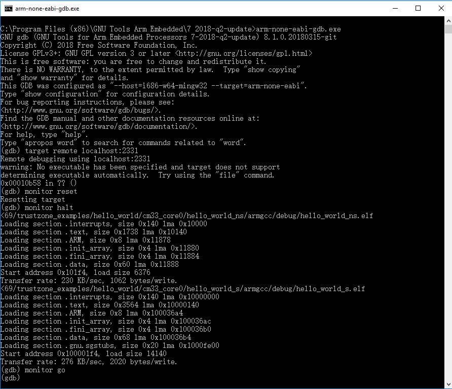

# Run a TrustZone example application 

When running a TrustZone application, the same prerequisites for J-Link/J-Link OpenSDA firmware, and the serial console as for the single core application, apply, as described in [Run an example application](arm_gcc_run_an_example_application.md).

To download and run the TrustZone application, perform Steps [1](arm_gcc_run_an_example_application.md#step1) to [10](arm_gcc_run_an_example_application.md#step10), as described in [Run an example application](arm_gcc_run_an_example_application.md). These steps are common for both single core and trustzone applications in Arm GCC.

Then, run these commands:

1.  `arm-none-eabi-gdb.exe`
2.  `target remote localhost:2331`
3.  `monitor reset`
4.  `monitor halt`
5.  `load <install_dir>/boards/mcxn9xxevk/trustzone_examples/hello_world/cm33_core0/hello_world_ns/armgcc/debug/hello_world_ns.elf`
6.  `load <install_dir>/boards/mcxn9xxevk/trustzone_examples/hello_world/cm33_core0/hello_world_s/armgcc/debug/hello_world_s.elf`
7.  The application is now downloaded and halted at the watch point. Execute the `monitor go` command to start the demo application.

**Parent topic:**[Run a demo using Arm GCC](../topics/arm_gcc_run_a_demo_application.md)

