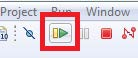

# Run an example application

For more information on debug probe support in the MCUXpresso IDE, see [community.nxp.com](https://community.nxp.com/message/630901).

To download and run the application, perform the following steps:

1.  See [Table 1](default_debug_interfaces.md#TABLE_UVC_BLB_DR_20REL4) to determine the debug interface that comes loaded on your specific hardware platform. For LPCXpresso boards, install the DFU jumper for the debug probe, then connect the debug probe USB connector.
    -   For boards with a P&E Micro interface, see [PE micro](http://www.pemicro.com/support/downloads_find.cfm) to download and install the P&E Micro Hardware Interface Drivers package.
2.  Connect the development platform to your PC via a USB cable.
3.  Open the terminal application on the PC, such as PuTTY or TeraTerm, and connect to the debug serial port number \(to determine the COM port number, see [How to determine com port](how_to_determine_com_port.md).

    Configure the terminal with these settings:

    1.  115200 or 9600 baud rate, depending on your board \(reference `BOARD_DEBUG_UART_BAUDRATE` variable in `board.h` file\)
    2.  No parity
    3.  8 data bits
    4.  1 stop bit
     configurations")

4.  On the **Quickstart Panel**, click on **Debug mcxn9xxevk\_hello\_world \[Debug\]** to launch the debug session.

    

5.  The first time you debug a project, the **Debug Emulator Selection** dialog is displayed, showing all supported probes that are attached to your computer. Select the probe through which you want to debug and click **OK**. \(For any future debug sessions, the stored probe selection is automatically used, unless the probe cannot be found.\)

    

6.  The application is downloaded to the target and automatically runs to `main()`.

     when running
                debugging")

7.  Start the application by clicking **Resume**.

    

8.  The `hello_world` application is now running and a banner is displayed on the terminal. If this is not the case, check your terminal settings and connections.

    

**Parent topic:**[Run a demo application using MCUXpresso IDE](../topics/ide_run_a_demo_application.md)

