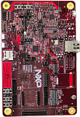

.. _mcxn9xxevk:

MCX-N9XX-EVK
####################

Overview
********

| The NXP N9xx-EVK is a development board for the N9xx 150 MHz Arm Dual Cortex-M33 TrustZone microcontroller, which is for Industrial and Consumer IoT Applications.

MCU device and part on board is shown below:

 - Device: MCXN947
 - PartNumber: MCXN947VDF
 

Getting Started with MCUXpresso SDK Package
*******************************************
.. toctree::
   :maxdepth: 1

   gettingStarted/gsindex.md

Getting Started with MCUXpresso SDK GitHub
*******************************************
.. toctree::
   :maxdepth: 1

   ../../../gsd/repo.rst

Release Notes
*******************************************
.. toctree::
   :maxdepth: 1

   releaseNotes/rnindex.md
