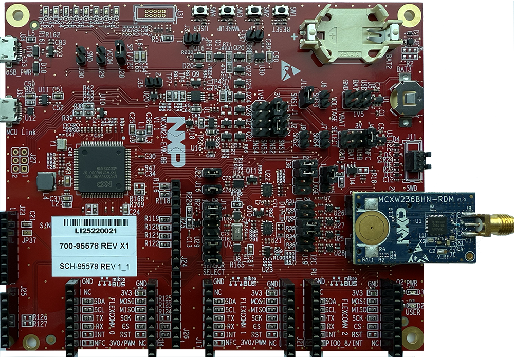

:pdf-download: ../../../_assets/boards/mcxw23evk/mcuxsdk-mcxw23evk.pdf
.. _mcxw23evk:

MCXW23-EVK
####################

Overview
********

The NXP MCXW23-EVK is a development board for the MCXW23 32 MHz Arm Cortex-M33 microcontroller.

MCU device and part on board is shown below:

 - Device: MCXW236B
 - PartNumber: MCXW236BIHNAR

Getting Started with MCUXpresso SDK GitHub
*******************************************

**Before debugging the silicon, remove the jumper on J32.**

.. toctree::
   :maxdepth: 1

   ../../../gsd/repo.rst

   gettingStarted/topics/how_to_determine_com_port.md
   gettingStarted/topics/updating_debugger_firmware.md
   
Release Notes
*******************************************

**This is an Ready For Production Release (RFP) for MCXW23-EVK development board.**

.. toctree::
   :maxdepth: 1

   releaseNotes/rnindex.md

ChangeLog
*******************************************
.. toctree::
   :maxdepth: 1

   changeLog/clindex.md

Driver API Reference Manual
****************************

This section provides a link to the Driver API RM, detailing available drivers and their usage to help you integrate hardware efficiently.

:ref:`MCXW236B_drivers`

Middleware Documentation
*****************************

Find links to detailed middleware documentation for key components. While not all onboard middleware is covered, this serves as a useful reference for configuration and development.

Wireless Bluetooth LE host stack and applications
=================================================

:ref:`examples__wireless_examples__bluetooth_docs`

Wireless Connectivity Framework
===============================

.. toctree::
   :maxdepth: 1

   ../../../middleware/wireless/framework/index.rst

FreeRTOS
========

:ref:`freertos`
