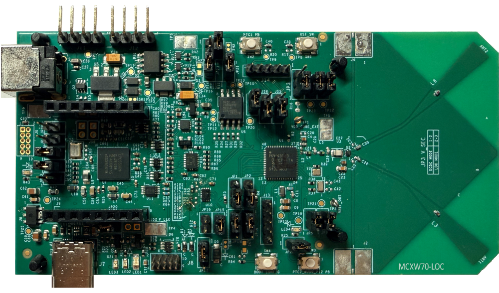

:pdf-download: ../../../_assets/boards/mcxw70loc/mcuxsdk-mcxw70loc.pdf

.. _mcxw70loc:

MCXW70-LOC
####################

Overview
********

The MCXW70-LOC is an automotive evaluation kit development board for advanced development of the MCXW70 wireless MCU. This localization platform is dedicated to Bluetooth Channel Sounding Ranging solution development with a dedicated on-chip Localization Compute Engine to reduce ranging latency. It offers exhaustive evaluation of MCXW70 MCUs with 2.4 GHz Bluetooth Low Energy and generic FSK wireless connectivity and CAN connectivity.
The board includes an advanced MCU-Link debug probe, Power and low power option, CAN transceivers, buttons, switches, LEDs and integrated sensors, a MikroE Click connector and other headers.

MCU device and part on board is shown below:

 - Device: MCXW70AC
 - PartNumber: MCXW70ACMFT

SDK Introduction
*******************

.. only:: html

   For an introduction to the MCUXpresso SDK, see :doc:`MCUXpresso Software Development Kit (SDK) </introduction/README>`.

.. only:: latex

   .. toctree::
      :maxdepth: 1

      /introduction/README

Getting Started with MCUXpresso SDK Package
*******************************************
.. toctree::
   :maxdepth: 1

   gettingStarted/gsindex.md

Getting Started with MCUXpresso SDK GitHub
*******************************************
.. toctree::
   :maxdepth: 1

   ../../../gsd/repo.rst

Release Notes
*******************************************

**This is an early adopter release provided as preview for development with pre-production devices.**

.. toctree::
   :maxdepth: 1

   releaseNotes/rnindex.md

ChangeLog
*******************************************
.. toctree::
   :maxdepth: 1

   changeLog/clindex.md

Driver API Reference Manual
****************************

This section provides a link to the Driver API RM, detailing available drivers and their usage to help you integrate hardware efficiently.

:ref:`MCXW70AC_drivers`

Middleware Documentation
*****************************

Find links to detailed middleware documentation for key components. While not all onboard middleware is covered, this serves as a useful reference for configuration and development.

Wireless Bluetooth LE host stack and applications
=================================================

:ref:`examples__wireless_examples__bluetooth_docs`

Wireless Connectivity Framework
===============================

:doc:`framework <../../../middleware/wireless/framework/index>`

FreeRTOS
========

:ref:`freertos`

Trusted-Frimware-M
==================

:ref:`tfm`
