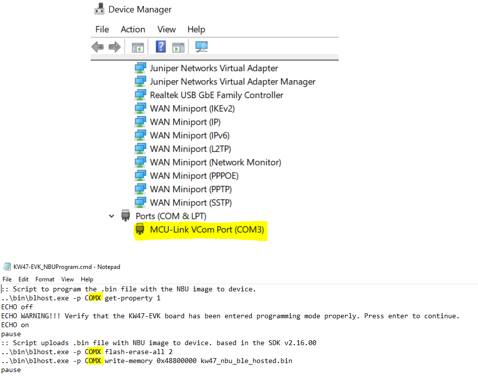

# Updating NBU for Wireless Examples

The Narrow Band Unit \(NBU\) firmware is included in the SDK folder as a signed and encrypted FW.

*middleware\\wireless\\ble\_controller\\bin\\mcxw72\_nbu\_ble\_hosted.bin*

To program the NBU software for the MCX-W72, perform the following steps:

1.  While holding pressed the **SW4** on the MCX-W72-EVK board, attach the USB connector J14 to your computer. Then, release the **SW4** after you plugged the USB cable on your computer.

    

2.  Verify which COM port is assigned to your board. To check the assigned COM port, in the Windows **Device Manager** program, search for Ports **\(COM & LPT\)** and save the COM port number. In this example, the assigned COM port is **COM3**.

    

3. Execute the following commands in order, replacing **COMX** with your actual COM port number (e.g., **COM3**):

    Make sure the device has entered ISP mode properly. If the device did not enter in ISP mode, it cannot be programmed.
    ```
    blhost.exe -p COMX get-property 1
    ```

    Erase NBU flash
    ```
    blhost.exe -p COMX flash-erase-all 2
    ```

    Program NBU binary into NBU flash
    ```
    blhost.exe -p COMX write-memory 0x48800000 mcxw72_nbu_ble_hosted.bin
    ```

    The following examples show when the device did not enter in ISP \(left\) and when the device was programmed properly \(right\).

    
