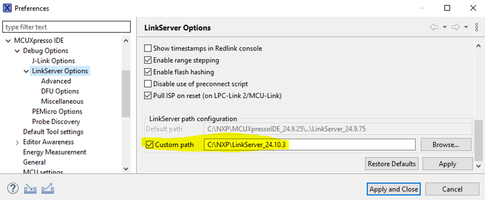

# Run a demo using MCUXpresso IDE 

**Note:** Ensure that the MCUXpresso IDE toolchain is included when generating the MCUXpresso SDK package.

**Note:** The latest MCUX IDE 24.9.25 cannot support MCXW72 multicore examples compiling, users need to upgrade to the Linkserver\_24.10.22 or higher version, and change the LinkServer path configuration in the MCUX IDE.



This section describes the steps required to configure MCUXpresso IDE to build, run, and debug example applications. The `hello_world` demo application targeted for the MCX-W72-EVK hardware platform is used as an example, though these steps can be applied to any example application in the MCUXpresso SDK.

LinkServer from the [nxp.com](http://nxp.com) does not have support for MCX W72. It is available only internally. You can download the installer for LinkServer distributed via the [MCX W72 Early Access Sharepoint](https://nxp1.sharepoint.com/teams/ext131/MCX_Alpha/SitePages/Home.aspx?RootFolder=%2Fteams%2Fext131%2FMCX%5FAlpha%2FDocument%2FW%20Series%2FMCX%20W72%20Advanced%20Information%2F04%2E%20Tools&FolderCTID=0x012000A56B1109B4B59044B4922AB984431F87&View=%7BF33BE67D%2D2534%2D44E7%2D98DF%2DB6B5CB8174CF%7D).

After the LinkServer is installed, to customize the LinkServer in MCUXpresso IDE, go to **Window** -\> **Preferences** -\> **MCUXpresso IDE** -\> **Debug Options** -\> **LinkServer Options**.


```{include} ../topics/ide_selecting_the_workspace_location.md
:heading-offset: 1
```

```{include} ../topics/ide_building_an_example_application.md
:heading-offset: 1
```

```{include} ../topics/ide_running_an_example_application.md
:heading-offset: 1
```

