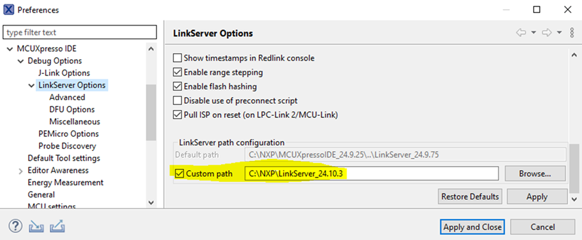

# Latest MCUX IDE 24.9.25 cannot support MCXW72 multicore compiling 

The latest MCUX IDE 24.9.25 cannot support MCXW72 multicore compiling, users need to upgrade to the Linkserver\_24.10.22 or higher version, and change the LinkServer path configuration in the MCUX IDE. Two ways to change the LinkerSever path in the MCUX IDE.

**Option 1 \(recommended\): Using the custom Path**



**Option 2: Using the command-line to change the settings**

1.  Close the MCUXpresso IDE if it is open.
2.  Execute the following command:

    ```
    <path_to_MCUXpressoIDE_installation_folder>\ide\mcuxpressoide -application com.nxp.mcuxpresso.headless.application -nosplash -run set.config.preference com.nxp.mcuxpresso.core.debug.support.linkserver:linkserver.path.default_path=<path_to_LinkServer_installation_folder>
    ```

    where:

    -   `<path_to_MCUXpressoIDE_installation_folder>` is the folder where the MCUXpresso IDE is installed.
    -   `<path_to_LinkServer_installation_folder>` is the folder where the new/custom LinkServer is installed.

Example:

```
C:\NXP\MCUXpressoIDE_24.9.25\ide\mcuxpressoide -application com.nxp.mcuxpresso.headless.application -nosplash -run set.config.preference com.nxp.mcuxpresso.core.debug.support.linkserver:linkserver.path.default_path=c:\NXP\LinkServer_24.10.15
```

**Parent topic:**[Known issues](../topics/known_issues.md)

