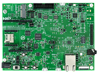

.. _evkcmimxrt1060:

MIMXRT1060-EVKC
####################

Overview
********

The i.MX RT1060 EVKC is a 4-layer through-hole USB-powered PCB. At its heart lies the i.MX RT1060 crossover MCU, featuring NXPs advanced implementation of the Arm Cortex-M7 core. This core operates at speeds up to 600 MHz to provide high CPU performance and excellent real-time response.

Support for FreeRTOS available within the MCUXpresso SDK.

The i.MX RT1060 Evaluation Kit is supported by Zephyr OS for developing the Internet of Things with a free, open-source embedded operating system.

Rev B includes M.2 and audio interfaces.

MCU device and part on board is shown below:

 - Device: MIMXRT1062
 - PartNumber: MIMXRT1062DVL6B

Getting Started with MCUXpresso SDK Package
*******************************************
.. toctree::
   :maxdepth: 1

   gettingStarted/gsindex.md

Getting Started with MCUXpresso SDK GitHub
*******************************************
.. toctree::
   :maxdepth: 1

   ../../../gsd/repo.rst

Release Notes
*******************************************
.. toctree::
   :maxdepth: 1

   releaseNotes/rnindex.md

ChangeLog
*******************************************
.. toctree::
   :maxdepth: 1

   changeLog/clindex.md
