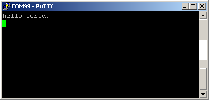

# Run an example application

To download and run the application, perform these steps:

1.  This board supports the `CMSIS-DAP/mbed/DAPLink` debug probe by default. Visit [os.mbed.com/handbook/Windows-serial-configuration](https://os.mbed.com/handbook/Windows-serial-configuration) and follow the instructions to install the Windows® operating system serial driver. If running on Linux OS, this step is not required.
2.  Connect the development platform to your PC via USB cable.
3.  Open the terminal application on the PC, such as PuTTY or TeraTerm, and connect to the debug serial port number \(to determine the COM port number, see [How to determine COM port](how_to_determine_com_port.md)\). Configure the terminal with these settings:

    1.  115200 or 9600 baud rate, depending on your board \(reference `BOARD_DEBUG_UART_BAUDRATE` variable in the `board.h` file\)
    2.  No parity
    3.  8 data bits
    4.  1 stop bit
     configurations")

4.  To debug the application, click **load** \(or press the F8 key\). Then, click the **Start/Stop Debug Session** button, highlighted in red in [Figure 2](run_an_example_application_002.md#S1234098A702). If using **J-Link** as the debugger, click **Project option** \>**Debug** \>**Settings** \>**Debug** \>**Port**, and select **SW**.

    **Note:** When debugging with jlink, it expects one jlinkscript file named JLinkSettings.JLinkScript in the folder where the uVision project files are located. For details, see Segger Wiki. For the contents in this JlinkSettings.JLinkScript, use contents in evkmimxrt1020\_sdram\_init.jlinkscript.

     when run debugging")

5.  Run the code by clicking **Run** to start the application, as shown in [Figure 3](run_an_example_application_002.md#S12702).

    

    The `hello_world` application is now running and a banner is displayed on the terminal, as shown in [Figure 4](run_an_example_application_002.md#S127DD02). If this is not true, check your terminal settings and connections.

    

**Parent topic:**[Run a demo using Keil® MDK/μVision](../topics/run_a_demo_using_keil__mdk_vision.md)

