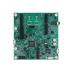

:pdf-download: ../../../_assets/boards/evkmimxrt1010/mcuxsdk-evkmimxrt1010.pdf
.. _evkmimxrt1010:

MIMXRT1010-EVK
####################

Overview
********

The NXP MIMXRT1010-EVK is a development board for the i.MX MIMXRT1011 500 MHz 32-bit ARM Cortex-M7 MCUs.

MCU device and part on board is shown below:

 - Device: MIMXRT1011
 - PartNumber: MIMXRT1011DAE5A

Getting Started with MCUXpresso SDK Package
*******************************************
.. toctree::
   :maxdepth: 1

   gettingStarted/gsindex.md

Getting Started with MCUXpresso SDK GitHub
*******************************************
.. toctree::
   :maxdepth: 1

   ../../../gsd/repo.rst
Release Notes
*******************************************
.. toctree::
   :maxdepth: 1

   releaseNotes/rnindex.md

ChangeLog
*******************************************
.. toctree::
   :maxdepth: 1

   changeLog/clindex.md

Driver API Reference Manual
****************************

This section provides a link to the Driver API RM, detailing available drivers and their usage to help you integrate hardware efficiently.

:ref:`MIMXRT1011_drivers`

Middleware Documentation
*****************************

Find links to detailed middleware documentation for key components. While not all onboard middleware is covered, this serves as a useful reference for configuration and development.

FreeMASTER
==========

.. toctree::
   :maxdepth: 1

   ../../../middleware/freemaster/doc/index.md

FreeRTOS
========

:ref:`freertos`

File systemFatfs
================

:ref:`fatfs`
