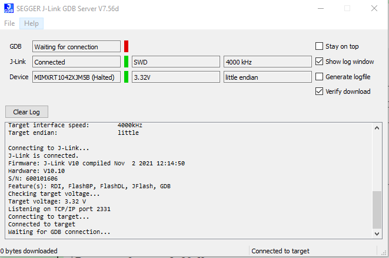
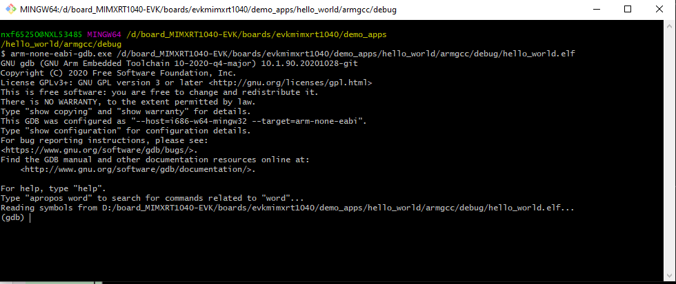

# Run an example application

This section describes steps to run a demo application using J-Link GDB Server application. To perform this exercise, make sure that either:

-   The OpenSDA interface on your board is programmed with the J-Link OpenSDA firmware. If your board does not support OpenSDA, then a standalone J-Link pod is required.
-   You have a standalone J-Link pod that is connected to the debug interface of your board.

    **Note:** Some hardware platforms require hardware modification in order to function correctly with an external debug interface.


After the J-Link interface is configured and connected, follow these steps to download and run the demo applications:

1.  This board supports the J-Link debug probe. Before using it, install SEGGER software, which can be downloaded from [http://www.segger.com](http://www.segger.com).
2.  Connect the development platform to your PC via USB cable between the OpenSDA USB connector and the PC USB connector. If using a standalone J-Link debug pod, also connect it to the SWD/JTAG connector of the board.
3.  Open the terminal application on the PC, such as PuTTY or TeraTerm, and connect to the debug serial port number \(to determine the COM port number, see [How to determine COM port](how_to_determine_com_port.md)\). Configure the terminal with these settings:

    1.  115200 or 9600 baud rate, depending on your board \(reference `BOARD_DEBUG_UART_BAUDRATE` variable in the `board.h` file\)
    2.  No parity
    3.  8 data bits
    4.  1 stop bit
    | configurations")

|

4.  Open the J-Link GDB Server application. Go to the SEGGER install folder. For example, *C:\\Program Files\(x86\)\\SEGGER\\JLink\_Vxxx*. Open the command windows. For Debug and Release targets, use the `JLinkGDBServer.exe` command. For the `sdram_debug`, `sdram_release`, `flexspi_nor_sdram_debug`, and `flexspi_nor_sdram_release` targets, use the `JLinkGDBServer.exe-scriptfile <install_dir>/boards/evkmimxrt1040/demo_apps/hello_world/evkmimxrt1040_sdram_init.jlinkscript` command.
5.  The target device selection chosen for this example is **MIMXRT1042XJM5B**.
6.  After it is connected, the screen should resemble [Figure 2](run_an_example_application.md#FIG_SEGGERJLINK).

    |

|

7.  If not already running, open a GCC Arm Embedded tool chain command window. To launch the window, from the Windows operating system **Start menu**, go to **Programs** \> **GNU Tools Arm Embedded <version\>** and select **GCC Command Prompt**.

    |

|

8.  Change to the directory that contains the example application output. The output can be found in using one of these paths, depending on the build target selected:

    ```
    <install_dir>/boards/<board_name>/<example_type>/<application_name>/armgcc/debug
    ```

    ```
    <install_dir>/boards/<board_name>/<example_type>/<application_name>/armgcc/release
    ```

    For this example, the path is:

    ```
    <install_dir>/boards/evkmimxrt1040/demo_apps/hello_world/armgcc/debug
    ```

9.  Run the `arm-none-eabi-gdb.exe <application_name>.elf`. For this example, it is `arm-none-eabi-gdb.exe hello_world.elf`.

    |

|

10. Run these commands:

    1.  `target remote localhost:2331`
    2.  `monitor reset`
    3.  `monitor halt`
    4.  `load`
11. The application is now downloaded and halted at the reset vector. Execute the `monitor go` command to start the demo application.

    The `hello_world` application is now running and a banner is displayed on the terminal. If this is not true, check your terminal settings and connections.

    |

|


**Parent topic:**[Run a demo using Arm GCC](../topics/run_a_demo_using_arm_gcc.md)

