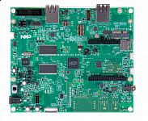

.. _evkmimxrt1160:

MIMXRT1160-EVK
####################

Overview
********

i.MX RT1160 crossover MCUs are part of the EdgeVerse edge computing platform, achieving 600MHz performance. This MCU family combines superior computing power and multiple media capabilities with ease of use and real-time functionality. The dual core i.MX RT1160 MCU runs on the Arm Cortex-M7 core at 600 MHz and Arm Cortex-M4 at 240 MHz, while providing excellent security. The i.MX RT1160 MCU offers support over a wide temperature range and is designed for consumer, industrial and automotive markets. The i.MX RT1160 evaluation kit (EVK) provides a high-performance solution enabled by a 6-layer PCB with through-hole design for better EMC performance - all at a low cost.

MCU device and part on board is shown below:

 - Device: MIMXRT1166
 - PartNumber: MIMXRT1166DVM6A

Getting Started with MCUXpresso SDK Package
*******************************************
.. toctree::
   :maxdepth: 1

   gettingStarted/gsindex.md

Getting Started with MCUXpresso SDK GitHub
*******************************************
.. toctree::
   :maxdepth: 1

   ../../../gsd/repo.rst

Release Notes
*******************************************
.. toctree::
   :maxdepth: 1

   releaseNotes/rnindex.md
