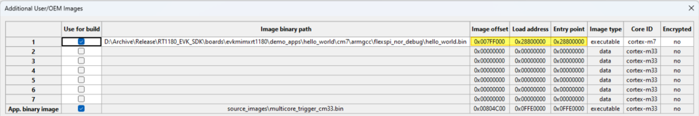
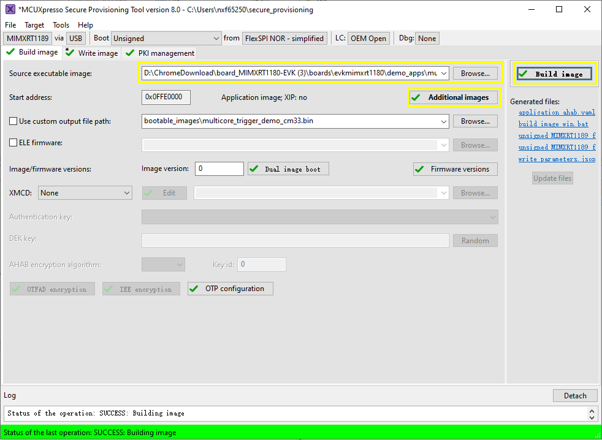
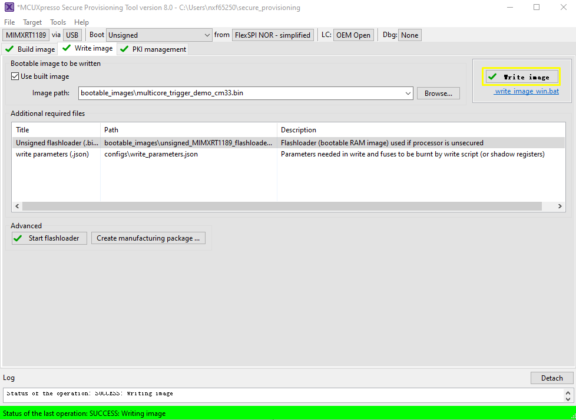
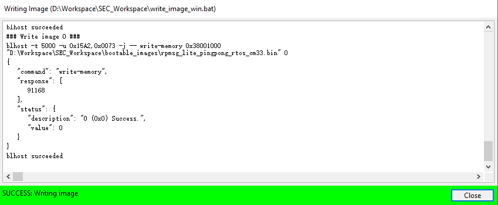

# CM7 XIP image runs from external FLASH, and `multicore_trigger` CM33 image runs from internal RAM 

Perform the following steps:

1.  Prepare the `multicore_trigger_demo_cm33` ram image \(`debug` or `release` targets\) and specify it in `Source executable image`.
2.  Specify the XMCD file if necessary, refer to [Use SPT tool to boot cm33 image](use_SPT_tool_to_boot_cm33_image.md).
3.  Use `Additional images` to specify CM7 application image running from flash memory. See [Table 1](#table_para) for how to fill in the necessary information for this additional image.

    | Parameter    | Value        | Explanation                                                                                                                                                                                                                               |
    |--------------|--------------|-------------------------------------------------------------------------------------------------------------------------------------------------------------------------------------------------------------------------------------------|
    | Image offset | `0x007FF000` | The offset in bytes from the beginning of the current container header to beginning of the image. In our case, the CM7 image is flashed to `0x2880_0000`. The container header is put to `0x2800_1000` and the yield offset = `0x7F_F000` |
    | Load address | `0x28800000` | The destintion address of the CM7 image. ROM copies the image to load address, if it is not within flash address space. In our case, copy does not happen                                                                                 |
    | Entry point  | `0x28800000` | The start address of CM7 image vector table from the CM7 core address space                                                                                                                                                               |
    | Core ID      | cortex-m7    | Specify the core ID                                                                                                                                                                                                                       |
    | Image type   | Executable   | Specify the image type                                                                                                                                                                                                                    |
    | Encrypted    | No           | Specify the encryption                                                                                                                                                                                                                    |

    

4.  \(Optional\) ELE firmware.

    It is required for certain application images which need special ELE FW service. For most SDK demos, leaves it empty.

5. Use `Build image` to build the combined bootable image. `SW5[1..4]` needs to be set to `0001` to let the SOC in serial download mode here.

    

6. Use `Write image` to flash the image. 

    

    

After a successful write, change the `SW5[1..4]` to QSPI boot mode `0100` and reset the board. You can observe that the image is running from POR boot.

**Parent topic:**[Use SPT tool and multicore\_trigger image to kick off cm7 binary image](../topics/use_SPT_tool_and_multicore_trigger_image.md)

