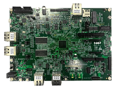

:pdf-download: ../../../_assets/boards/evkmimxrt1180/mcuxsdk-evkmimxrt1180.pdf
.. _evkmimxrt1180:

MIMXRT1180-EVK
####################

Overview
********

MCU device and part on board is shown below:

 - Device: MIMXRT1189
 - PartNumber: MIMXRT1189CVM8B

Getting Started with MCUXpresso SDK Package
*******************************************
.. toctree::
   :maxdepth: 1

   gettingStarted/gsindex.md

Getting Started with MCUXpresso SDK GitHub
*******************************************
.. toctree::
   :maxdepth: 1

   ../../../gsd/repo.rst

Release Notes
*******************************************
.. toctree::
   :maxdepth: 1

   releaseNotes/rnindex.md

ChangeLog
*******************************************
.. toctree::
   :maxdepth: 1

   changeLog/clindex.md

Driver API Reference Manual
****************************

This section provides a link to the Driver API RM, detailing available drivers and their usage to help you integrate hardware efficiently.

:ref:`MIMXRT1189_drivers`

Middleware Documentation
*****************************

Find links to detailed middleware documentation for key components. While not all onboard middleware is covered, this serves as a useful reference for configuration and development.

Multicore
=========

:ref:`multicore`

MCU Boot
========

:doc:`mcuboot_opensource<../../../middleware/mcuboot_opensource/README.md>`

eIQ
===

:ref:`eiq`

FreeMASTER
==========

:doc:`freemaster <../../../middleware/freemaster/doc/index>`

AWS IoT
=======

:ref:`aws_iot`

NXP Wi-Fi
=========

:ref:`wifi-bluetooth-802.15.4`

FreeRTOS
========

:ref:`freertos`

Wireless EdgeFast Bluetooth PAL
===============================

:ref:`edgefast_bluetooth`

lwIP
====

:ref:`lwip`

File systemFatfs
================

:ref:`fatfs`
