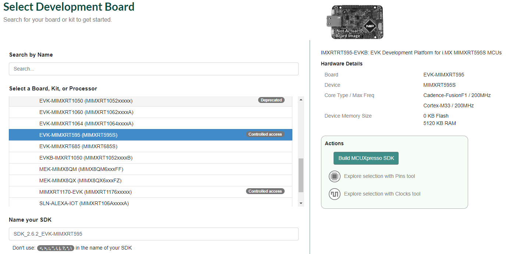

# Download MCUXpresso SDK for RT500

DSP enablement for RT500, including drivers, middleware libraries, and demo applications are included with the latest RT500 SDK available for download at [https://mcuxpresso.nxp.com](https://mcuxpresso.nxp.com/).

**Note:** Ensure to register, if you are accessing the page for the first time.

Log in to use the SDK builder. The steps are:

1.  Click **Select Board**.
2.  Search by name for board: **RT595**’.
3.  Select **EVK-MIMXRT595**.
4.  Click **Build MCUXpresso SDK**.

    |

|

**Parent topic:**[Install MCUXpresso SDK](../topics/install_mcuxpresso_sdk.md)

