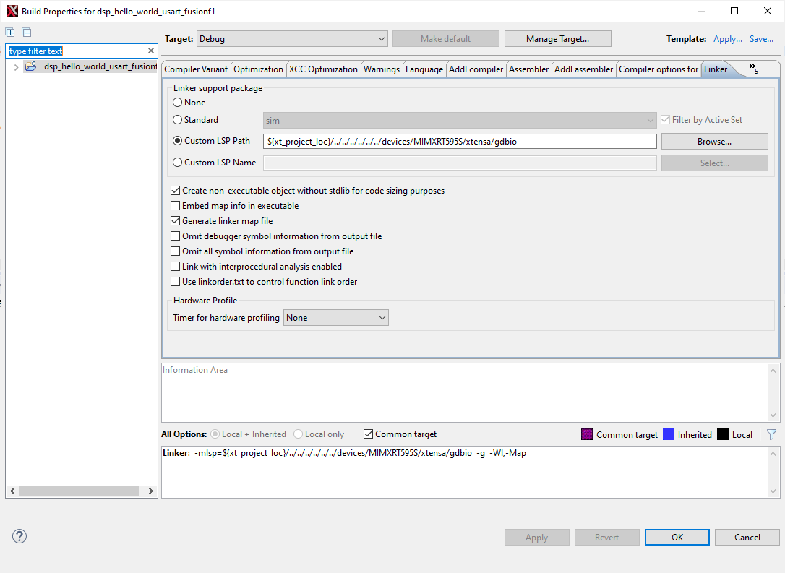

# DSP Linking Profiles

The Xtensa Software Tools use linker support packages \(LSPs\) to link a Fusion DSP application for the RT500. An LSP includes both a system memory map and a collection of libraries to include into the final binary. These LSPs are provided in the MCUXpresso SDK under <SDK\_ROOT\>/devices/MIMXRT595S/xtensa/.

DSP sample applications are configured to link against one of these custom LSPs. By default, ‘Debug’ targets links against the gdbio LSP which is intended to be used with an attached debugger and captures I/O requests \(printf\) through gdb. The ‘Release’ target links against the min-rt LSP which includes minimal runtime support.

You can see and change which LSP is being actively used by the project target in the Xplorer IDE in the Linker menu of the project.

|

|

|

|

The MCUXpresso SDK ships with other standard LSPs for RT500. For more information on using LSPs and how to create a custom memory map using Xtensa software tools, see the Cadence Linker Support Packages \(LSPs\) Reference Manual.

**Parent topic:**[Run and Debug DSP Demo using Xplorer IDE](../topics/run_and_debug_dsp_demo_using_xplorer_ide.md)

