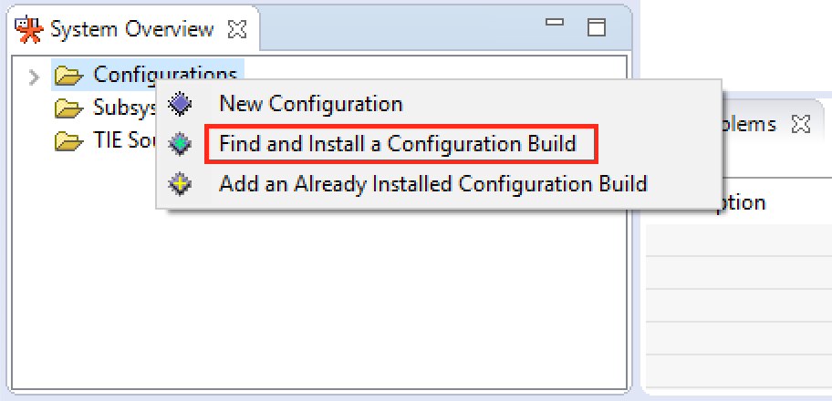
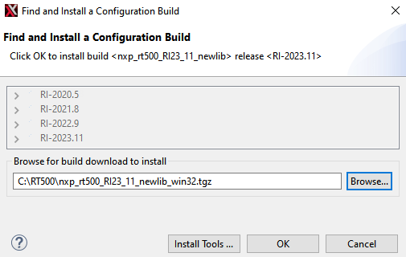

# Install RT500 DSP Build Configuration

‘Build Configuration’ is a term that describes all parameters and necessary build includes for the Tensilica processor implementation you are developing with. It is mandatory to install a specific build configuration before starting development on RT500.

The build configuration is provided by NXP as a binary file that can be imported into the Xplorer IDE. This file can be downloaded for your OS from the Tensilica URL.

The build configuration can be installed into the IDE using the ‘System Overview’ panel which is in the lower left corner by default. If this panel is not visible, it can be toggled using menu item **Window \> Show View - System Overview**.

|

|

|

|

Select the directory and click **OK**.

**Parent topic:**[Install Xplorer Toolchains](../topics/install_xplorer_toolchains.md)

