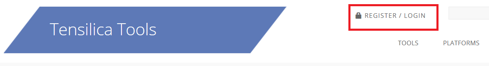

# Install the Xtensa Xplorer IDE and Tools

To install the Xtensa Xplorer IDE and tools:

1.  Go to the URL [https://tensilicatools.com/download/fusion-f1-dsp-sdk-for-rt500/](https://tensilicatools.com/download/fusion-f1-dsp-sdk-for-rt500/) and log in.

    **Note:** Ensure to register, if you are accessing the page for the first time. You must use your corporate email address to register.

    |

|

2.  You receive an email confirmation with an activation link from ‘**Tensilica Tools**’ [no-reply@tensilicatools.com](mailto:no-reply@tensilicatools.com).

    **Note:** Ensure to check the spam folder if this email is not in your inbox. Click the activation link to complete the registration.

3.  Login with your credentials to see the available materials for download.
    -   Download and install the **XTENSA Xplorer IDE V10.1.11** for your operating system \(Windows or Linux\).
    -   Download the **DSP Configuration V10.1.11** for your operating system. This is installed later through the IDE. For details, see [Install RT500 DSP Build Configuration](install_rt500_dsp_build_configuration.md).

        **Note:** NXP recommends version **10.1.11** of the Xtensa Xplorer IDE and tools for use with the RT500 DSP.

**Parent topic:**[Install Xplorer Toolchains](../topics/install_xplorer_toolchains.md)

