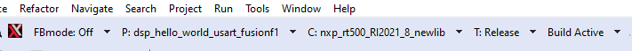

# Launch DSP Application from Arm Core

In the previous example, the Arm application and DSP application were independently loaded and debugged. This section shows how to produce an Arm application binary that includes and starts the DSP application without the use of a debugger/loader.

The Arm core application for each DSP demo uses a global preprocessor macro to control loading of the DSP binary application:

DSP\_IMAGE\_COPY\_TO\_RAM

This macro is set to 1 by default. When this macro is set to ‘1’/TRUE, it instructs the DSP demo application to do the following:

-   Link the DSP application binary images into the Arm binary
-   Copy the DSP application images into RAM on program boot
-   Initialize the DSP to run from the RAM image

**Note:** Ensure that this macro is supplied to both the C compiler and assembler when modifying the Arm project.

To build the DSP application image so it can be used by the Arm application, you must select the ‘Release’ target in Xplorer IDE \(building with min-rt LSP – see section 2.4 for more information\).



Three DSP binaries are generated.

```
<SDK_ROOT>\boards\evkmimxrt595\dsp_examples\xaf_record\dsp\binary\**dsp\_text\_release.bin**
<SDK_ROOT>\boards\evkmimxrt595\dsp_examples\xaf_record\dsp\binary\**dsp\_data\_release.bin**
<SDK_ROOT>\boards\evkmimxrt595\dsp_examples\xaf_record\dsp\binary\**dsp\_reset\_release.bin**
```

**Note:** Depending on the environment used, you may need to manually copy these binary images into your Arm application workspace.

**Parent topic:**[Run and Debug DSP Demo using Xplorer IDE](../topics/run_and_debug_dsp_demo_using_xplorer_ide.md)

