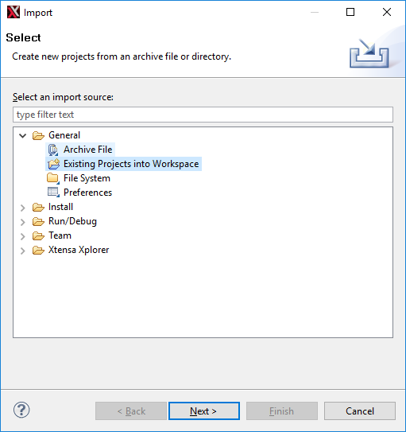
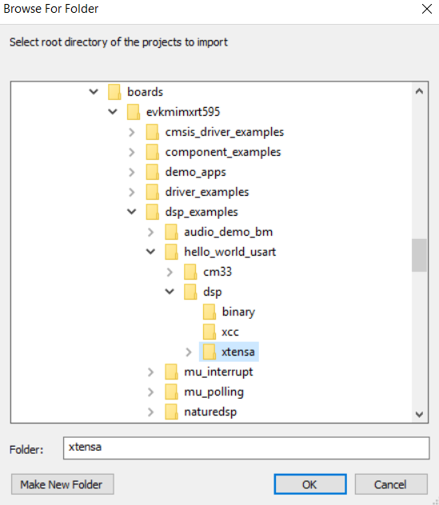
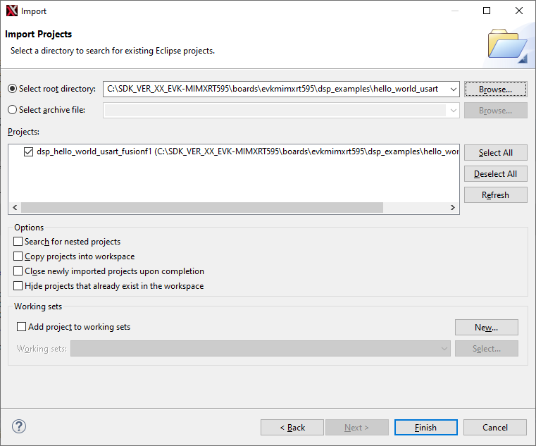

# Prepare DSP Core for ‘Hello World’

The RT500 SDK provides a collection of DSP example applications located under `boards/evkmimxrt595/dsp_examples/`. Each DSP example has two source directories, one for the Arm Cortex-M33 core \(‘cm33’\) and one for the DSP fusion f1 core \(‘fusionf1’\):

Under these directories are build projects for different supported toolchains. For the DSP example above, the ‘xcc’ project allows to build on the command line and the ‘xtensa’ directory is an Xplorer IDE project.

To run the ‘Hello World’ demo, first you must import SDK sources into Xplorer IDE.

1.  Use menu item **File \> Import \> Existing Projects into Workspace**.

    |

|

2.  Select SDK directory `<SDK_ROOT>\boards\evkmimxrt595\dsp_examples\hello_world_usart \fusionf1\xtensa` as root directory and leave all other check boxes blank as default.

    |

|

3.  Click **OK**.

    |

|

4.  Click the **Finish** button.

    The 'dsp\_hello\_world\_usart\_fusionf1’ project appears in the **Project Explorer**.

    .

**Parent topic:**[Run and Debug DSP Demo using Xplorer IDE](../topics/run_and_debug_dsp_demo_using_xplorer_ide.md)

