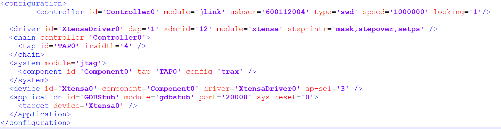
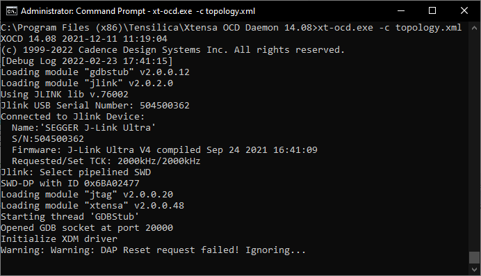
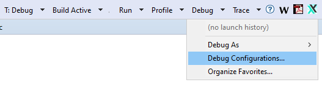
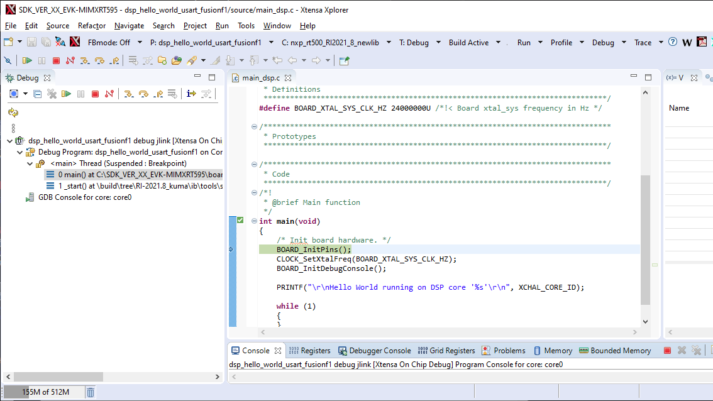
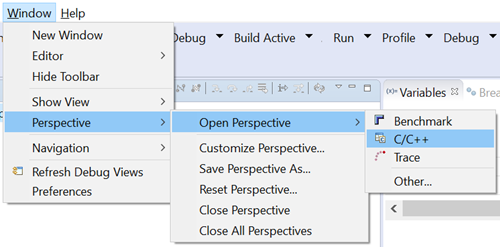

# Start Xtensa Debugger Daemon

Connect the EVK board to a PC via the USB debug interface \(J40\) and open up a serial interface on your PC using a terminal tool such as Tera term or PuTTY on Windows or screen on Linux.

Remove Jumpers JP17, JP18, JP19 for SWD to connect to the chip and Serial interface on J40.

1.  Load CM33 hello\_world\_usart you build from step 3.1 using J-link
2.  To debug DSP applications on RT500, you must have the xt-ocd daemon up running. This application runs a gdb server that the Xtensa core debugger connects with.
3.  Go to the command-line window and cd to xt-ocd daemon installation path. By default, it is C:\\Program Files \(x86\)\\Tensilica\\Xtensa OCD Daemon 14.11 on Windows.
4.  Update the topology.xml file with your J-link serial number. Topology.xml file: Edited J-link serial number in usbser field. Ensure dap = 1 in order for it to work.

    

5.  Execute the daemon with your custom topology:

    ```
    xt-ocd.exe -c topology.xml
    ```

    

    **Note:** tSome warning messages are expected and can be ignored. If you receive an error initializing the XDM driver, you may need to initialize and start he DSP core before debugging. For details, see [DSP Core Initialization](dsp_core_initialization.md).

    **Note:** For more information on xt-ocd runtime options and configuration, see Chapter 7 of the Xtensa Debug Guide \(available in Help \> PDF Documentation\).

6.  Use the action buttons on the right side of the menu bar to debug / profile / trace. A default debug configuration is provided by the SDK project which utilizes the on-chip debugger.

    

    

7.  Once the **Debug**’ button is selected, the actual debug on the chip starts. Xplorer prompts you to download binaries to the hardware.

    

8.  Select **Yes**.
9.  Xplorer IDE transitions to the **Debug** perspective after binary download.
10. After stepping through the ‘printf’ statement, the output appears in the Console view of the IDE.

    

11. Hello World starts running on core `nxp_RT500_RI23_11_newlib`.
12. After the debug is complete, select the previous code perspective to return to the default IDE layout.

    


**Parent topic:**[Run and Debug DSP Demo using Xplorer IDE](../topics/run_and_debug_dsp_demo_using_xplorer_ide.md)

