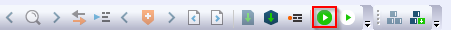
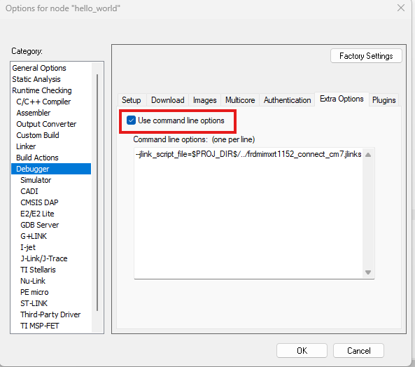
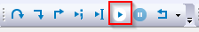
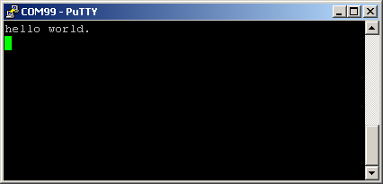

# Run an example application

To download and run the application, perform these steps:

1.  This board supports the CMSIS-DAP/mbed/DAPLink debug probe by default. Visit [MBED](https://os.mbed.com/handbook/Windows-serial-configuration) and follow the instructions to install the Windows® operating system serial driver. If running on Linux OS, this step is not required.
2.  Connect the development platform to your PC via USB cable. Connect the USB cable to J11 and make sure SW1\[1:4\] is **0010b**.
3.  Open the terminal application on the PC, such as PuTTY or TeraTerm, and connect to the debug COM port \(to determine the COM port number, see [How to determine COM port](how_to_determine_com_port.md)\). Configure the terminal with these settings:

    1.  115200 or 9600 baud rate, depending on your board \(reference `BOARD_DEBUG_UART_BAUDRATE`variable in the *board.h*file\)
    2.  No parity
    3.  8 data bits
    4.  1 stop bit
     configuration")

4.  In IAR, click the **Download and Debug** button to download the application to the target.

    

    -   If debugging with J-Link as the probe, a `jlinkscript` file is needed. Select **J-Link/J-Trace** as the driver and uncheck **Use macro file(s)**, as shown in [Figure 3](#frdmimxrt1152_FIG_JLINK).

        (frdmimxrt1152_FIG_JLINK)=
        ")

        Then check **Use command line options**, as shown in [Figure 4](#frdmimxrt1152_FIG_CHECK), and set the command line option:

        (frdmimxrt1152_FIG_CHECK)=
        

        ```
        --jlink_script_file=$PROJ_DIR$/../frdmimxrt1152_connect_cm7.jlinkscript
        ```

5.  The application is then downloaded to the target and automatically runs to the `main()` function.

     when running debugging")

6.  Run the code by clicking the **Go** button to start the application.

    

7.  The `hello_world` application is now running and a banner is displayed on the terminal. If this is not true, check your terminal settings and connections.

    


**Note:** There are some limitations on MCUXpresso IDE debugging. For details, see **Section 8.6 IAR debug limitation** in *MCUXpresso SDK Release Notes for FRDM-IMXRT1152*.

**Parent topic:**[Run a demo application using IAR](../topics/run_a_demo_application_using_iar.md)

