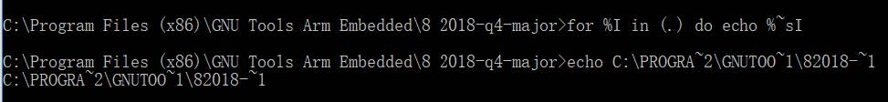
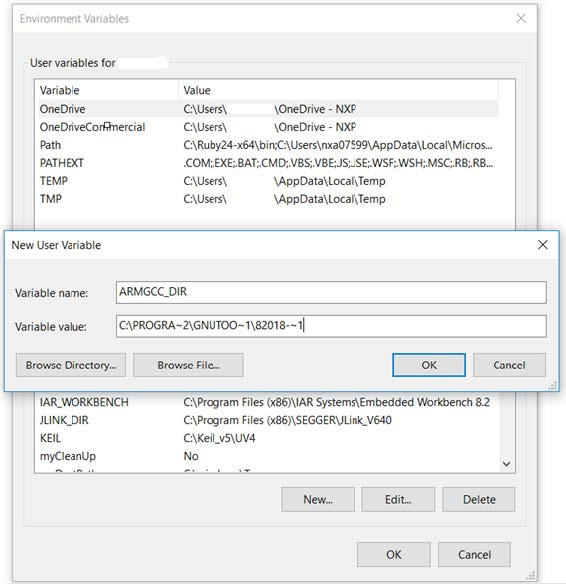

# Add a system environment variable for ARMGCC\_DIR

Create a `system` environment variable and name it as `ARMGCC_DIR`. The value of this variable should point to the Arm GCC Embedded tool chain installation path. For this example, the path is:

*C:\\Program Files \(x86\)\\GNU Tools ARM Embedded\\8 2018-q4-major*

For the exact path name of your installation, see the installation folder of the GNU Arm GCC Embedded tools.

Short path should be used for path setting. To convert the path to short path, run the `for %I in (.) do echo %~sI` command.

**Parent topic:**[Set up toolchain](../topics/armgcc_set_up_toolchain.md)

