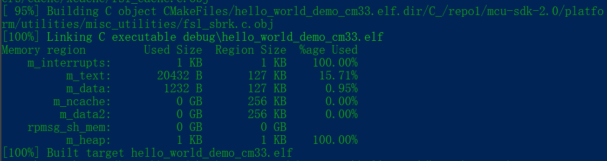

# Build an example application

To build an example application, perform the following steps.

1.  Open a GCC Arm Embedded tool chain command window. To launch the command window, select open the **Start** menu, and select **Programs** > **GNU Tools ARM Embedded <version\>** > **GCC Command Prompt**.

    

2.  Change the directory to the example application project directory, which has a path similar to the following:

    *<install\_dir\>/boards/<board\_name\>/<example\_type\>/<application\_name\>/<core\_type\>/armgcc*

    For this example, the exact path is:

    *<install\_dir\>/boards/frdmimxrt1186/demo\_apps/hello\_world/cm33/armgcc*

3.  Type **build\_debug.bat**on the command line or double click on **build\_debug.bat**file in Windows Explorer to build it. The output is as shown in [Figure 2](#FIG_HELLOWORLDSUCCESS).

    

**Parent topic:**[Run a demo using Arm GCC](../topics/run_a_demo_using_arm_gcc.md)

