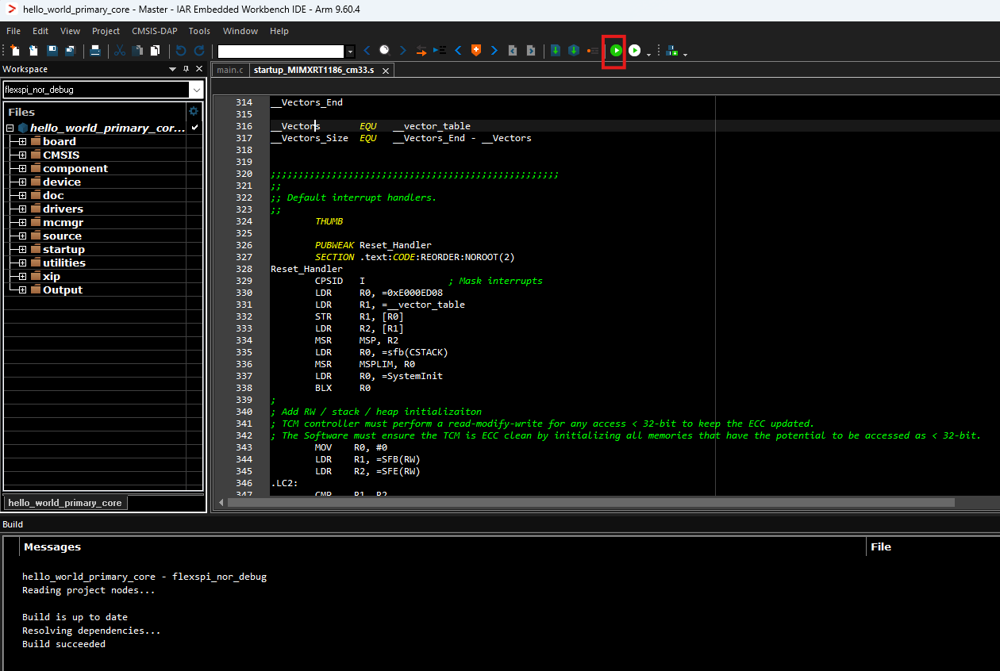
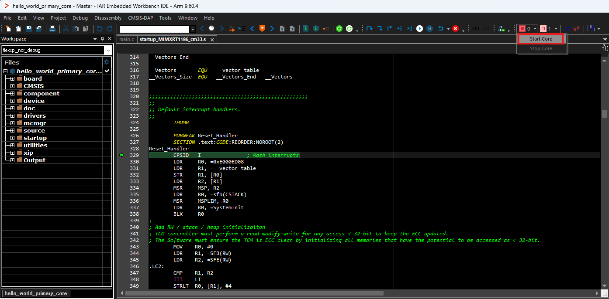
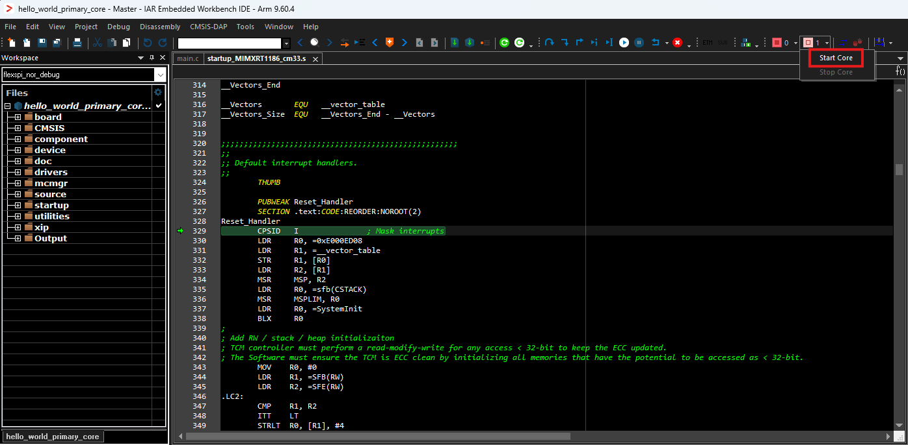
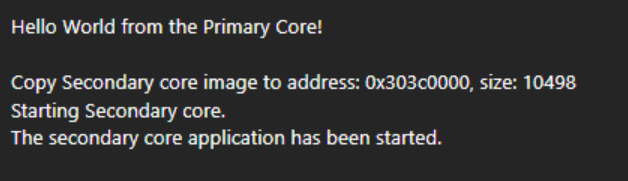

# Build and run a multicore example application

This section describes the steps to build and run a dual-core application. The demo applications workspace files are available in the folder: `<install_dir>/boards/<board_name>/multicore_examples/<application_name>/<core_type>/iar`

Begin with a simple dual-core version of the Hello World application. The multicore `Hello World IAR` workspaces are available in the folder:

`<install_dir>/boards/frdmimxrt1186/multicore_examples/hello_world/cm7/iar/hello_world_secondary_core.eww`

`<install_dir>/boards/frdmimxrt1186/multicore_examples/hello_world/cm33/iar/hello_world_primary_core.eww`

Build both applications separately by clicking the **Make** button. Build the application for the auxiliary core \(cm7\) first, because the primary core application project \(cm33\) must know the auxiliary core application binary when running the linker. When the auxiliary core application binary is not ready, it is impossible to finish the primary core linker.

By default, the primary core flexspi\_nor\_debug target links the auxiliary core debug target, and the primary core flexspi\_nor\_release target links the auxiliary core release target. During the primary core execution, the auxiliary core image is copied from flash into the CM7 RAM and executed.

1.  Build the CM7 and CM33 projects respectively.

2.  Only click the `Download and Debug` button on the CM33 project, IAR could help start to debug a multicore project. It is user-friendly to debug multicore examples with CMSIS-DAP on IAR \(Multicore Project is set on Debugger-\>Multicore window\).

    

3.  Start `core0` and then start `core1` on the CM33 project.

    

    

4.  `Hello_World` multicore demos are now running. A banner appears on the terminal and the LED D6 blinks. If this is not true, check your terminal settings and connections.

    

**Parent topic:**[Run a demo using IAR](../topics/run_a_demo_using_iar.md)

