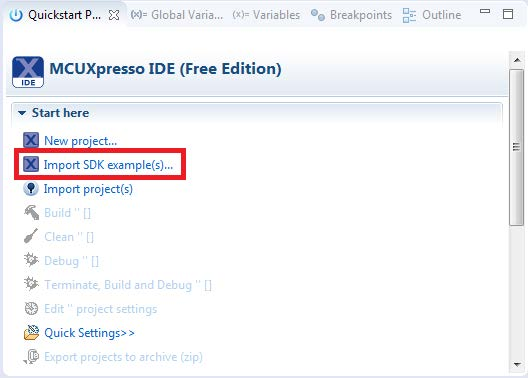
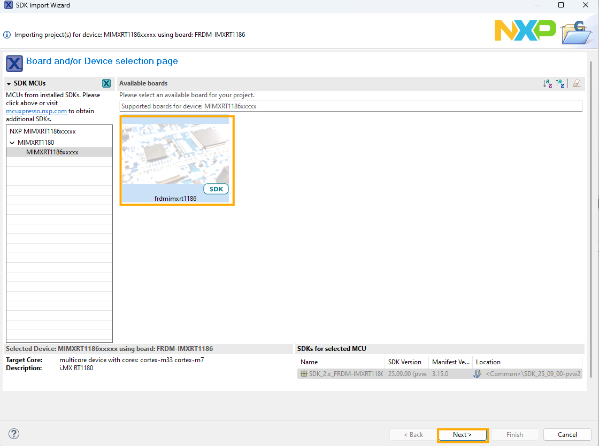
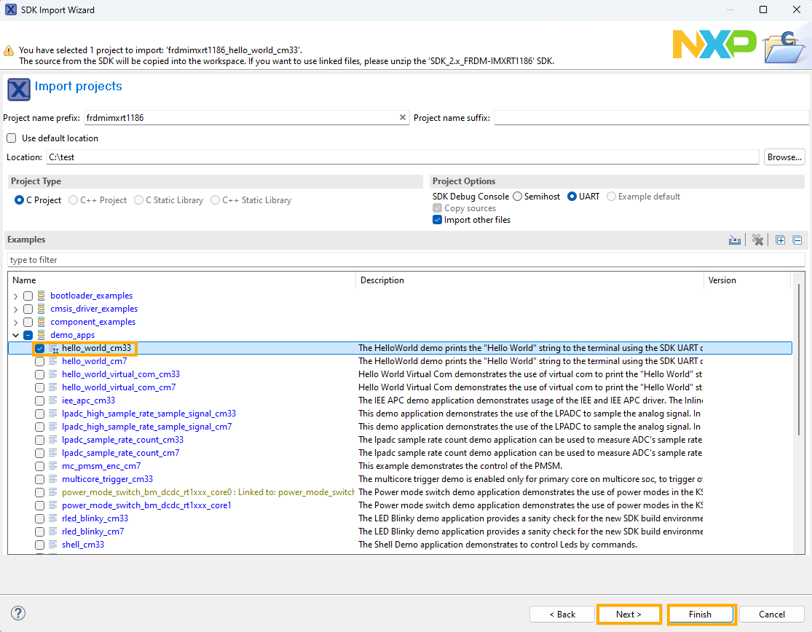

# Build an example application 

To build an example application, follow these steps.

1.  Drag and drop the SDK zip file into the **Installed SDKs** view to install an SDK. In the window that appears, click **OK** and wait until the import has finished.

    

2.  On the **Quickstart Panel**, click **Import SDK example\(s\)…**.

    

3.  In the window that appears, select **frdmimxrt1186** and click **Next**.

    

4.  Expand the *demo\_apps* folder and select `hello_world_demo_cm33`. Then, click **Next**.

    

5.  Click **Finish**.

**Parent topic:**[Run a demo using MCUXpresso IDE](../topics/run_a_demo_using_mcuxpresso_ide.md)

