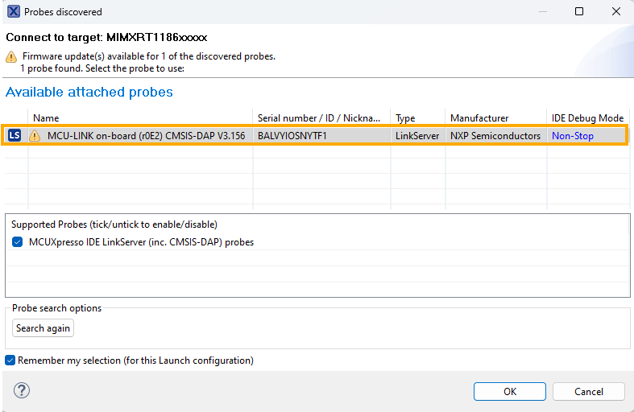
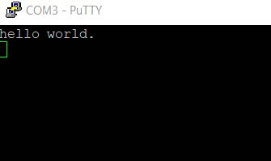

# Run an example application

To download and run the application, perform the following steps:

1.  See [Table 1](default_debug_interfaces.md#TABLE_HWPLATFORMS) to determine the debug interface that comes loaded on your specific hardware platform.
    -   For FRDMIMXRT1186, LPC55S69 is used.
    -   J23 is used as the debugging port which provides both debugging functionality and console out.
2.  Connect USB cable between J23 on EVK and PC USB port.
3.  Open the terminal application on the PC, such as, PuTTY or TeraTerm, and connect to the debug serial port number. To determine the COM port number, see [How to determine COM port](how_to_determine_com_port.md). Configure the terminal with these settings:

    1.  115200 baud rate or 9600 baud rate, depending on your board \(reference `BOARD_DEBUG_UART_BAUDRATE` variable in the *board.h* file\)
    2.  No parity
    3.  8 data bits
    4.  1 stop bit
     configurations")

4.  On the **Quickstart Panel**, click **Debug**.

    

    **Note:** Erase the flash memory before running the MCUX IDE projects for the first time. To do so, use the **Erase Flash action using LinkServer** in [Figure 2](#FIG_DEBUGHELLOWORLDCASES) with `J60[1..3]` on `001`. In the worst case when MCUX IDE cannot erase the flash, use the secure provisioning tool. For more information, see [Use Secure Provisiong Tool to erase flash](use_secure_provisiong_tool_to_erase_flash.md).

5.  The first time you debug a project, the **Debug Emulator Selection** dialog is displayed, showing all supported probes that are attached to your computer. Select the probe through which you want to debug and click **OK**. Here we assume that you are using a CMSIS-DAP debug interface. \(For any future debug sessions, the stored probe selection is automatically used, unless the probe cannot be found.\)

    

6.  The application is downloaded to the target and automatically runs to `main()`.

     when running debugging")

7.  Start the application by clicking **Resume**.

    

The `hello_world` application is now running and a banner is displayed on the terminal. If not , check your terminal settings and connections.

**Parent topic:**[Run a demo using MCUXpresso IDE](../topics/run_a_demo_using_mcuxpresso_ide.md)

