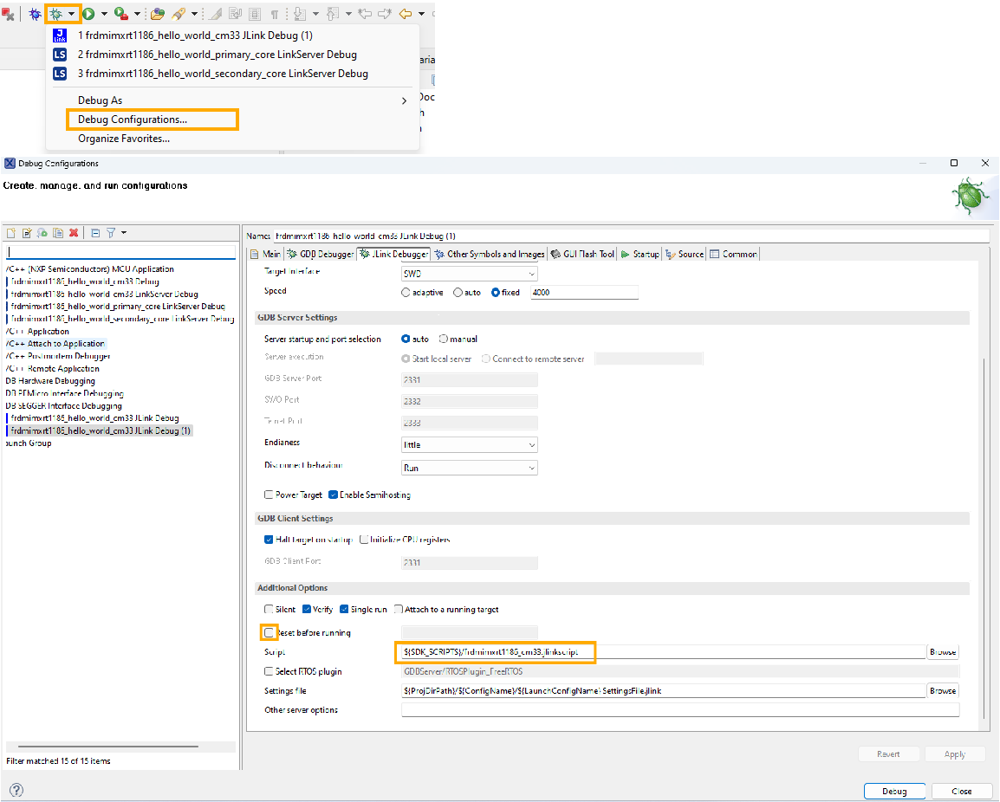

# Run applications via JLink Debug Interface

The previous sections assume that you are using the CMSIS-DAP debugging interface for MCUXpresso IDE to do the debugging. If you are using J-Link probe as a debugging interface, the configurations are slightly different.

1.  After you click the **Debug** button, the IDE shows the J-Link probe identified. Click **OK** to continue the debugging.

    

2.  If you investigate on debug configurations, you will notice two settings, which are different from CMSIS-DAP debugging. The **Reset before running** is unchecked, and a jlinkscript is specified. This is because of the difference in CMSIS-DAP and JLink debugging implementation. The differences are pre-configured by MCUX default project settings.

    

3.  The screenshot here shows a CM33 demo. For CM7 demo, situations are similar.

**Parent topic:**[Run a demo using MCUXpresso IDE](../topics/run_a_demo_using_mcuxpresso_ide.md)

