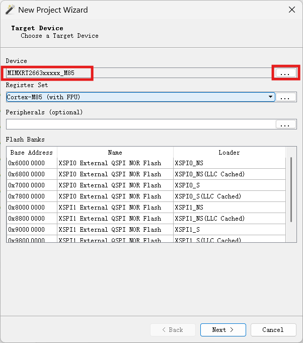
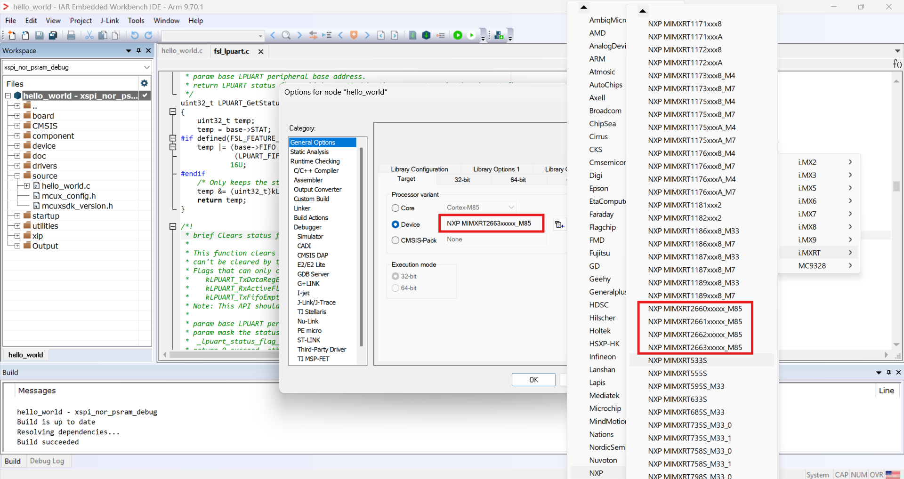

# Debug patch install

The RT2660 debug patch is now a **combined IAR + J-Link patch**, shipped as `iar_segger_support_patch_rt2660_vX.Y.zip`.

It supports debugging all targets on `MIMXRT2660`.

> **Where to obtain the zip**: refer to [Installing the third-party patch](../installing_third_party_patch.md) for how to get the `iar_segger_support_patch_rt2660_vX.Y.zip` package.

> **Use SWD, not JTAG**: RT2660 debug uses the **SWD** interface only. Set your probe's target interface to SWD in your IDE -- JTAG is **not** supported and the debugger will fail to connect. This applies to every flow in this guide (Ozone, and IAR C-SPY with either a J-Link or CMSIS-DAP probe).

## What's in the zip

Unzip `iar_segger_support_patch_rt2660_vX.Y.zip` -- it contains:

| File | Purpose | Needed for |
|---|---|---|
| `JLink.zip` | SEGGER J-Link device support (jlinkscript, flash loaders, `iMXRT2660.xml`) | Ozone, and IAR C-SPY with a J-Link probe |
| `arm.zip` | IAR EWARM debugger / device / flashloader / linker config files | IAR C-SPY (both J-Link and CMSIS-DAP probes) |
| `readme.txt` | Upstream install notes and MD5 checksums | Reference |

> **Use the latest patch**: newer `iar_segger_support_patch_rt2660_vX.Y.zip` releases carry fixes and broader scenario coverage -- always install the newest one.

- **Debugging in Ozone** -- you only need the [J-Link part](#install-the-j-link-part-jlinkzip).
- **Debugging inside IAR EWARM** -- install **both** the [J-Link part](#install-the-j-link-part-jlinkzip) and the [IAR part](#install-the-iar-part-armzip).

## Install the J-Link part (`JLink.zip`)

> **Existing patch**: If an older RT2660 patch is present, **remove the folder out of `JLinkDevices` entirely**.

> **Warning -- renaming does not disable it**: J-Link scans `JLinkDevices/**/*.xml` recursively and loads every `*.xml` regardless of the containing folder's name. A renamed folder is still loaded and will conflict.

Unzip `JLink.zip` and copy the `NXP\iMXRT2660\` folder (with its contents) into:

```
C:\Users\<username>\AppData\Roaming\SEGGER\JLinkDevices\NXP\iMXRT2660\
```

`NXP\iMXRT2660\` must then contain, directly:

- `iMXRT2660.xml`
- `iMXRT2660_M85.jlinkscript`
- `MIMXRT2660_XSPI0_NS.FLM` / `MIMXRT2660_XSPI0_S.FLM`
- `MIMXRT2660_XSPI1_NS.FLM` / `MIMXRT2660_XSPI1_S.FLM`

> **Tip**: `iMXRT2660.xml` auto-loads the jlinkscript when `MIMXRT2663xxxxx_M85` is selected -- leave the "J-Link Script File" field empty in your IDE.

### Upgrade J-Link to V8.88 or later

Older J-Link doesn't know the Cortex-M85 core and the jlinkscript will fail.

SEGGER downloads: https://www.segger.com/downloads/jlink/

> **DLL sync**: most IDEs (Ozone, IAR) bundle their own J-Link DLL -- the standalone installer doesn't always update those. Run SEGGER's `JLinkDLLUpdater.exe` (shipped with the J-Link install) to sync all bundled copies in one go.

### Verify the J-Link part

**Check 1: device picker shows `MIMXRT2663xxxxx_M85`**

In Ozone (or any J-Link-driven IDE), click `...` next to **Device** -- `MIMXRT2663xxxxx_M85` should be in the list. If it's not there, the J-Link part isn't loaded.



**Check 2: J-Link log shows the version banner**

The jlinkscript prints its version on every connect. In the J-Link log (Ozone console, IAR debug log, `JLinkGDBServer` stdout), look for:

```
iMXRT2660 Cortex-M85 core J-Link script - VX.Y
```

If the banner is missing or the version differs from what you installed, a stale patch is being loaded.

## Install the IAR part (`arm.zip`)

Only needed if you debug **inside IAR EWARM** (C-SPY). Skip this if you only use Ozone.

Unzip `arm.zip` and merge its `arm\` folder into your IAR EWARM installation's `arm\` folder, for example:

```
C:\Program Files\IAR Systems\Embedded Workbench 9.x\arm\
```

> **Merge, don't replace**: copy the patch's `arm\` **contents** over the existing `arm\` folder so the new files are added / overwritten. Do **not** delete other files already in IAR's `arm\` folder.

The patch overlays these IAR config files (under `arm\config\`):

- `debugger\NXP\` -- `.ddf`, `.dmac`, `.svd`, `MIMXRT2660_M85.ProbeConfig`
- `devices\NXP\i.MX\i.MXRT\` -- `.menu`, `.i79` device definitions
- `flashloader\NXP\` -- XSPI flash loaders (`.board`, `.flash`, `.out`, `.mac`)
- `linker\NXP\` -- `MIMXRT266xxxxxx_M85.icf` linker files

### Verify the IAR part

In IAR EWARM, open Project -> Options -> General Options -> Target. The RT2660 device variants (MIMXRT2660 / 2661 / 2662 / 2663) should be selectable. If they're missing, the IAR (`arm.zip`) part isn't installed.


