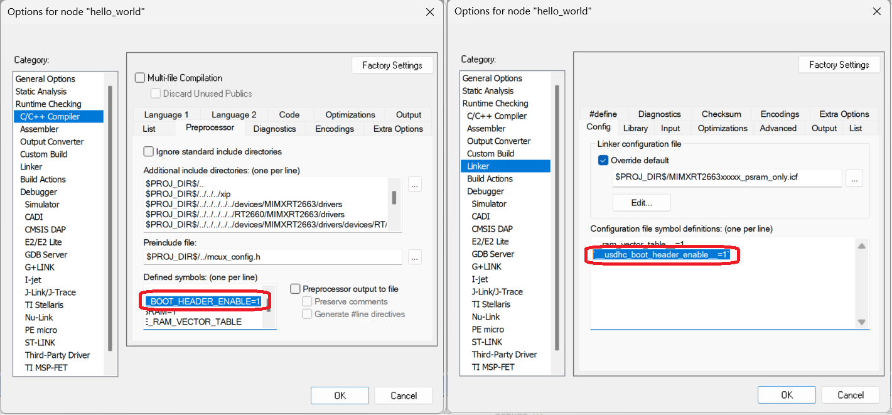

# RAM ONLY Targets

This page covers the two RAM ONLY targets: `ram_only` and `psram_only`.

## Debug

This section applies to the **default build only** -- no USDHC boot header.

The image is downloaded directly to RAM by the debugger with no flash programming step.

The image is volatile and is cleared on power cycle.

> **Note**: because the image is loaded directly into RAM by the debugger rather than booting through the normal reset sequence, the program behavior during this debug session may not fully match what happens during a real POR boot. For production validation, testing with a properly bootable image (with boot header) and a real POR cycle is recommended.

### `ram_only`

`ram_only` is useful for board bring-up, especially on a custom board where XSPI NOR flash may not yet be populated, configured, or trusted. The debugger downloads directly to ITCM without touching flash, so bring-up can proceed even if the flash side is not ready.

No special setup is needed. Build with the `ram_only` target, connect the debugger, download the ELF to ITCM, and debug.

### `psram_only`

`psram_only` is useful in two scenarios:

- **eMMC + PSRAM system**: Unified Linkage requires XSPI NOR as the boot medium and is not applicable here. `psram_only` provides a RAM-based debug path for these systems.
- **XSPI NOR + PSRAM system with a large image**: the Unified Linkage flash-program-then-debug cycle can be slow for large images. `psram_only` skips the flash programming step entirely and shortens the edit-build-debug iteration time.

PSRAM is not accessible out of reset. The debugger cannot download to PSRAM until PSRAM has been initialized. This requires a one-time preparation step before the first debug session.

#### One-time preparation: program an auxiliary image

The SDK auxiliary image embeds an XMCD in its boot header. Boot ROM reads this on every reset and uses the XMCD to initialize PSRAM. Once the auxiliary image is programmed, PSRAM is automatically available after each reset -- no debugger intervention needed.

> **Note**: this is a one-time step per board. Once done, the debug flow for `psram_only` is the same as `ram_only`.

**XSPI NOR + PSRAM scenario**

Use the SDK auxiliary demo built with the `xspi_nor_psram` target.

1. Build the auxiliary demo with target `xspi_nor_psram_debug`.
2. Set the boot switch to `0b00` (XSPI NOR boot mode) and reset the board.
3. Program the auxiliary image into XSPI NOR flash (standard Unified Linkage flash flow).

**eMMC + PSRAM scenario**

Use the SDK auxiliary demo built with the `psram_only` target. The `psram_only` target of the auxiliary demo has the USDHC boot header enabled by default, making it ready to program directly to eMMC.

1. Build the auxiliary demo with target `psram_only`.
2. Program the auxiliary binary into eMMC via blhost or SPSDK.
3. Set the boot switch to `0b00` (XSPI NOR boot mode) and reset the board.
4. Set the boot mode to eMMC boot (via fuse or shadow fuse) and reset the board.

> **Note**: For the complete eMMC setup procedure -- including hardware rework, boot mode configuration, and image download -- refer to the eMMC boot page in this guide.

## Creating a bootable image

The default `ram_only` / `psram_only` build produces a raw binary with no boot header, suitable only for download-to-RAM debug. To create an image that can POR boot from eMMC or XSPI NOR flash, a boot header must be attached.

There are two ways to do this:

**Option A -- build with USDHC boot header**: set the USDHC boot header flag at build time. The resulting binary contains the USDHC boot header and can be programmed to eMMC for POR boot. Only the USDHC (eMMC) boot header type is supported via this build-time path.

**Option B -- SPSDK**: build the default raw binary (no boot header), then use SPSDK or NXP Secure Provisioning Tool to attach a boot header of your choice and program to the target medium. Both USDHC (eMMC) and XSPI NOR flash boot header types are supported via this path. Refer to the SPSDK page in this guide for the steps.

> **Note**: an image with a boot header (Option A or Option B after header attachment) is intended for standalone POR boot and **cannot** be used for the download-to-RAM debug flow.

### Option A: west build

The following example uses armgcc. Pass both settings via a `reconfig.cmake` file:

```cmake
# reconfig.cmake -- enable USDHC boot header for ram_only / psram_only

mcux_remove_configuration(
    TARGETS ram_only_debug ram_only_release psram_only_debug psram_only_release
    CC "-DUSDHC_BOOT_HEADER_ENABLE=0"
)
mcux_add_configuration(
    TARGETS ram_only_debug ram_only_release psram_only_debug psram_only_release
    CC "-DUSDHC_BOOT_HEADER_ENABLE=1"
)
mcux_add_armgcc_configuration(
    TARGETS ram_only_debug ram_only_release psram_only_debug psram_only_release
    LD "-Xlinker --defsym=__usdhc_boot_header_enable__=1"
)
```

### Option A: IAR EWARM

In IAR EWARM Project Options:

- **C/C++ Compiler > Preprocessor > Defined symbols**: change `USDHC_BOOT_HEADER_ENABLE=0` to `USDHC_BOOT_HEADER_ENABLE=1`
- **Linker > Config > Configuration file symbol definitions**: add `__usdhc_boot_header_enable__=1`


