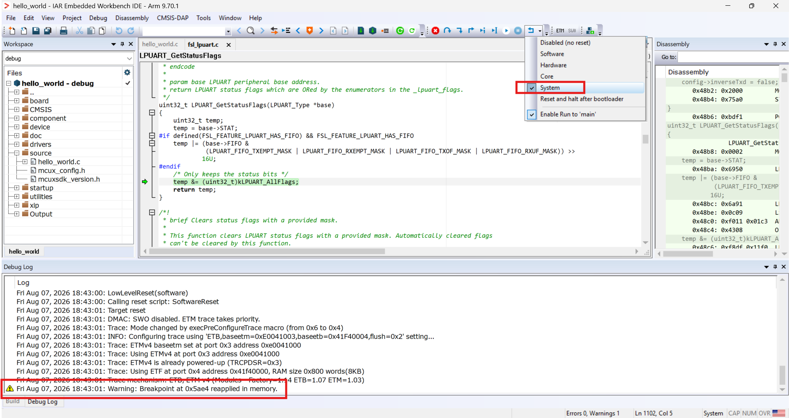
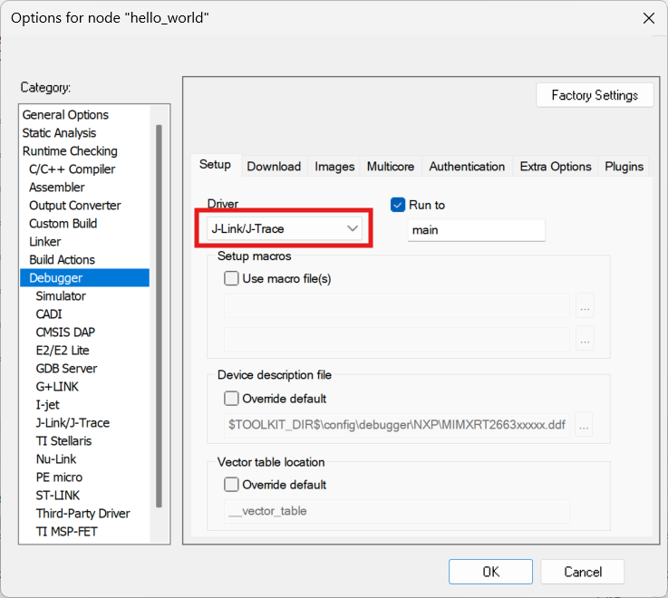

# Setup -- IAR EWARM

## Build

Open the SDK example's `.eww`, pick a target from the configuration dropdown, and build.

## Debug inside IAR EWARM (C-SPY)

Before starting a C-SPY debug session, ensure the IAR patch and J-Link patch are both installed. Refer to the patch install page in this guide for details.

### Using a CMSIS-DAP probe (default)

1. Project -> Options -> Debugger -> Driver = **CMSIS DAP** (SDK default).
2. Download and debug.

> **Note**: to reset the system in a debug session, set the reset type to **System** (as shown above). The debug-log line `Warning: Breakpoint at 0xAAAA reapplied in memory` is expected and is not a bug.

### Using a J-Link probe

1. Project -> Options -> Debugger -> Driver = **J-Link/J-Trace**, as below.
2. Download and debug.

   
