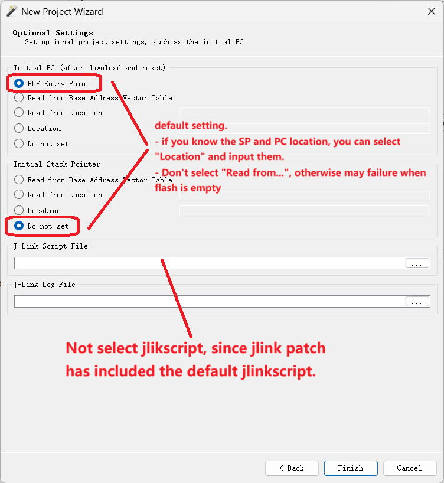
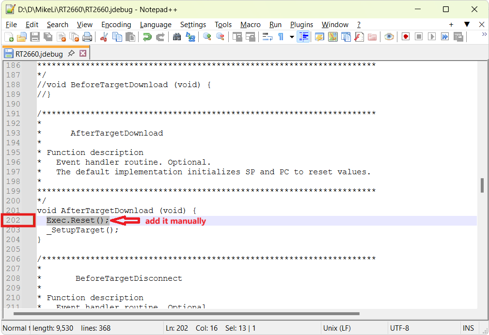

# Setup -- SEGGER Ozone

Ensure the J-Link patch is installed, refer to the patch install section in this guide.

Ozone v3.50 or later is recommended.

## RAM ONLY targets

No special setup is needed. Pick `MIMXRT2663xxxxx_M85`, create a project, download the ELF, and debug.

> **Note**: for `psram_only`, a one-time preparation step is required before the first debug session -- the SDK auxiliary image must be programmed so that Boot ROM initializes PSRAM on every reset. Without this, the debugger cannot download to PSRAM. See the RAM ONLY Targets section of this guide for the steps.

## Unified Linkage targets

Applies to all five Unified Linkage targets.

### Step 1: PC / SP configuration

Set PC and SP in the New Project Wizard as shown:

### Step 2: Save the project, then hand-edit `.jdebug`

**Critical.** After saving through the GUI, open the `.jdebug` in a text editor and apply the edits below:

> **Tip**: the `.jdebug` is a one-time setup. For subsequent debug sessions with a different ELF, open the same `.jdebug` project in Ozone and load the new `.elf` / `.out` -- no need to re-create the project each time.

### Step 3: Debug and Attach

Once the `.jdebug` edit is done:

- **Debug** -- Ozone programs XSPI NOR then starts execution.
- **Attach** -- connect to a target that's already running.

### Known issues

**Source view incorrect on `debug` / `psram` / `psram_txt` targets with IAR ELF**: When an IAR-built ELF is loaded in Ozone for these targets, the source view may show the wrong line or fail to follow the PC. Cause is a DWARF compatibility issue between IAR-generated ELFs and Ozone. Registers, disassembly, and memory windows are unaffected.