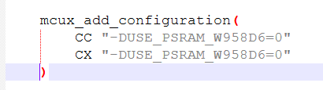
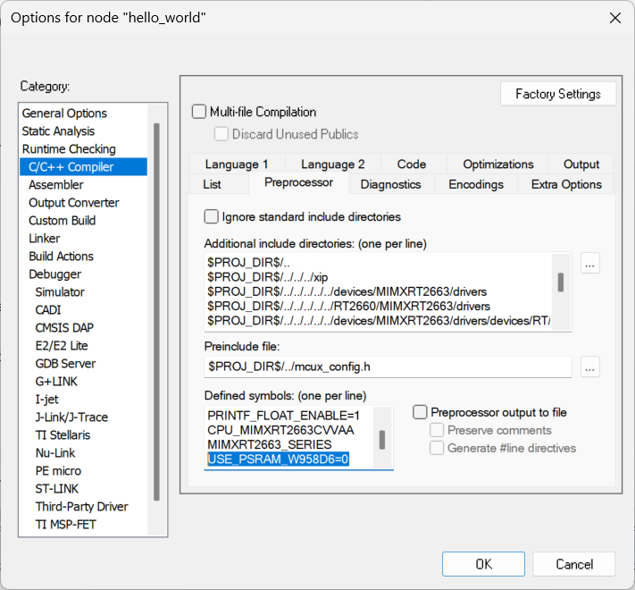

# MIMXRT2660-EVK PSRAM Configuration

This document describes the PSRAM device populated on the MIMXRT2660-EVK and the corresponding SDK source-code macro setting.

## PSRAM on the MIMXRT2660-EVK

The MIMXRT2660-EVK is populated with a **Winbond W958D6** PSRAM device, which is supported by the SDK.

## PSRAM Selection Macro

The SDK uses a compile-time macro, `USE_PSRAM_W958D6`, to select the PSRAM initialization, FlexSPI/XSPI configuration and related code that is built. For the MIMXRT2660-EVK (W958D6), set:

```
USE_PSRAM_W958D6=1
```

The XSPI1 clock is configured automatically by the SDK according to the macro (250 MHz for W958D6); it does not need to be set manually.

## Where to set the macro

### SDK repository (CMake build)

Edit the following file in the SDK repo and set `USE_PSRAM_W958D6` to `1`:

```text
mcuxsdk/examples/_boards/mimxrt2660evk/CMakeLists.txt
```



### IAR Embedded Workbench

If you are working from a generated IAR project, set the macro in the project's preprocessor defined symbols instead of the CMake file.


